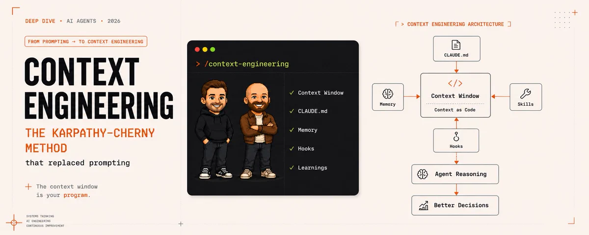
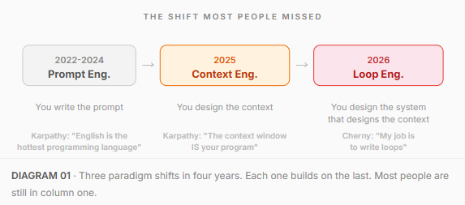
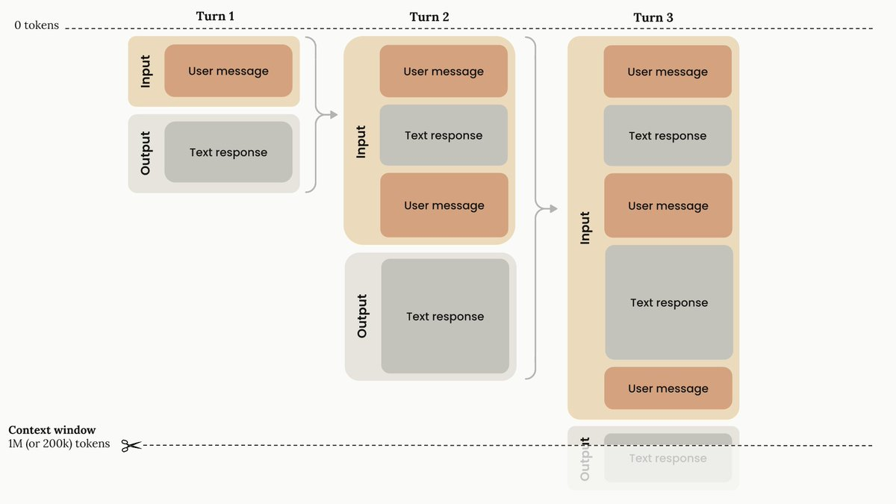
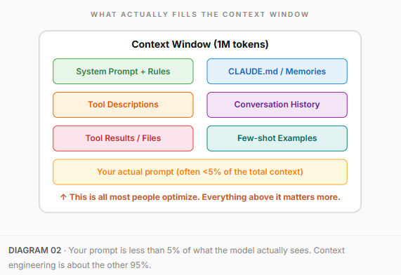
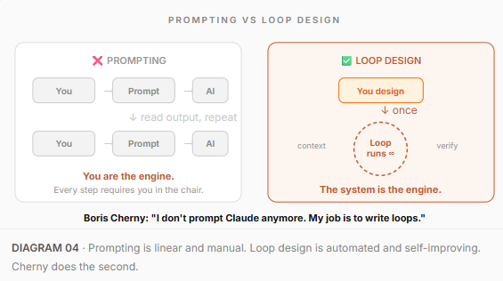
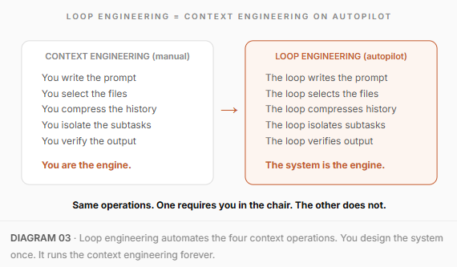
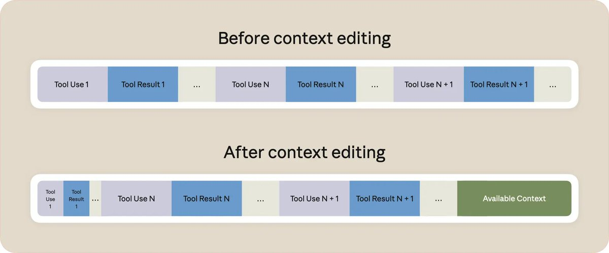
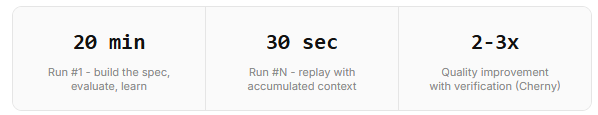

# Context Engineering: the Karpathy-Cherny method that replaced prompting



> Prompt engineering is one instruction. Context engineering is the whole operating system.

---

### The same model can score 0.637 or 0.488 on the same benchmark.

Same weights. Same question. The only difference is what else was in the context window when the model answered.

That gap is not a rounding error. It is the difference between a useful tool and an expensive autocomplete.

Everyone is arguing about which model is best. GPT vs Claude vs Gemini. Benchmarks, leaderboards, pricing tables. Meanwhile the people actually shipping with AI stopped caring about the model months ago.

> They are engineering the context.

Context engineering is the skill that replaced prompt engineering in 2025. And in 2026, two people turned it into a system: Andrej Karpathy defined the framework. Boris Cherny built the tools.

This article will explain:

1 - what context engineering actually is and why your prompt is less than 5% of what matters

2 - Karpathy's framework: the context window IS your program

3 - Cherny's framework: stop prompting, start designing loops

4 - how to build it yourself on Claude Code, with copy-paste prompts

5 - the honest part: what this does not fix

### Bookmark this.

---

## Part 1 | The evolution most people missed

There is a timeline that most AI users have not noticed. Three paradigm shifts in four years:



Prompt engineering is writing one good instruction. You craft the perfect sentence, hit enter, and hope for the best.

Context engineering is designing everything the model sees: which files, which history, which tool results, which rules. The prompt is one component. The context is the whole operating system.

Loop engineering is designing the system that does the context engineering for you, automatically, on repeat, while you sleep.

Each layer does not replace the previous one. It builds on top. A sloppy prompt inside a perfect loop still produces sloppy work faster. But the leverage moved. And most people have not noticed.

---

## Part 2 | Karpathy

## The context window IS your program



In April 2026, Andrej Karpathy gave a talk at Sequoia AI Ascent that reframed how the entire industry thinks about AI.

His framework: Software 3.0.

- Software 1.0: humans write explicit code
- Software 2.0: humans train neural networks with data
- Software 3.0: humans program models through context

The important part is not "write better prompts." The important part is that the context window becomes the new programming surface. You are no longer writing deterministic instructions. You are giving context to an intelligent interpreter that can read, reason, call tools, inspect environments, and adapt.

> "Context engineering is the delicate art and science of filling the context window with just the right information for the next step."  - Andrej Karpathy

Think of the LLM like a new operating system. The model is the CPU. The context window is RAM. And just like an OS decides what fits into a CPU's RAM, context engineering decides what fits into the model's working memory.

The difference between a good agent and a bad one is not the model. It's what's inside the context window when the model runs.



The four operations of context engineering

Karpathy and the research community landed on four core operations. Everything you do with context falls into one of these:

- Write - persist context outside the window. CLAUDE.md, skills, state files. Things the agent can read back later instead of holding in memory.
- Select - retrieve only what's relevant right now. Not everything. Not random chunks. The right 5 documents out of 50,000.
- Compress - summarize old information to save tokens. When history grows too long, compact it. Fresh tool results always get priority over stale conversation.
- Isolate - give subtasks their own clean context. This is the "context firewall" Boris Cherny invented. Each subagent gets a fresh window. Only structured output flows back.

A real problem called "context rot" happens when you skip these operations. As a conversation grows, irrelevant tokens pile up, signal-to-noise drops, and the model starts making worse decisions. The window did not get smaller. It got cluttered.

> The same model can score 0.637 or 0.488 on MMLU depending only on how you structure the context. Same model. Same question. Different context. Different result.

---

## Part 3 | Cherny

### Stop prompting. Start designing loops.



Boris Cherny built Claude Code. He runs it every day. And in June 2026, he said something that spread across the entire developer community:

> "I don't prompt Claude anymore. I have loops running that prompt Claude and figuring out what to do. My job is to write loops." - Boris Cherny, creator of Claude Code

That is not marketing. Cherny runs continuous loops in his own work: one agent hunts architecture improvements, another unifies duplicated abstractions, both submitting PRs indefinitely. The loop does the prompting. He designs the system.

How Loop Engineering connects to Context Engineering

Most articles frame loops as the "next level" after context engineering. That framing is backwards. A loop without good context engineering is just an expensive way to generate garbage on autopilot. Context engineering is the recipe. The loop is the kitchen that cooks it on repeat.

Every cycle of a loop does the same four operations Karpathy described:

- Write: the loop saves state to disk after each run (what worked, what failed, what's next)
- Select: on the next cycle, the loop loads only the relevant state, not the full history
- Compress: old runs get summarized. Fresh results get priority.
- Isolate: subagents handle subtasks in their own context windows. The main loop stays clean.

If those four operations are bad, the loop makes them bad faster. If they are good, the loop makes them good forever. Context engineering is the foundation. The loop is the engine that runs it.

That is why this article teaches context engineering first and loops second. Get the context right. Then automate it.



Cherny's 5 building blocks of a working loop

Every working loop, whether you build it in Claude Code, Codex, or bash scripts, is assembled from five pieces:

- Automation - the heartbeat. /loop for cadence, /goal for stopping conditions.
- Skill - project knowledge in a markdown file. Written once, read by every run.
- Sub-agents - split the maker from the checker. One writes, another verifies.
- Connectors - let the loop act in your real environment. Open PRs, ping Slack, update tickets.
- Verifier - the gate. Tests, type checks, builds that reject bad work automatically.

Cherny shared a data point: simply giving Claude effective verification methods typically improves final output quality by 2-3x.

> Without a verifier, you do not have a loop. You have the agent agreeing with itself on repeat.

---

## Part 4 | Build it yourself

### Context Engineering on Claude Code: step by step



Theory is over. Here is how to build it. Every prompt below is copy-paste.

> 4.1 - Set up the context layer (CLAUDE.md)

CLAUDE.md is the persistent context layer. It loads at every session start. Without it, every session starts from zero and the agent reinvents your conventions.

```bash
claude /init
```

Claude scaffolds a baseline from your codebase. Then curate it:

```markdown
# Project: e-commerce-api
# Stack: Node.js, TypeScript, PostgreSQL, Prisma

Test command: bun test
Lint command: bun run lint

# Rules
- Functional style, no classes
- Explicit error handling, no silent catches
- All API routes require Zod validation
- Payment routes require idempotency keys
- Never use `any` type
- Always run tests before committing
```

Keep it under 200 lines. Claude attends to about 150 instructions reliably. Each line must be earned.

> 4.2 - Write specs, not prompts

A prompt is a wish. A spec is an order. The context engineering version of "write a good prompt" is "design the full input the model needs to produce the right output."

```plaintext
❌ bad prompt:

Refactor the auth system
```

```plaintext
✅ good spec:

# Task: Migrate auth from session cookies to JWT

GOAL: Replace session-based auth with JWT tokens
      across all 23 API routes in /src/routes/

SCOPE:
- IN: /src/routes/, /src/middleware/auth.ts
- OUT: /src/routes/webhooks/ (leave untouched)

OUTPUT:
- Modified route files with JWT validation
- New /src/middleware/jwt.ts
- Updated tests for every changed route

ON CONFLICT: flag the file, do not resolve silently
STOP CONDITION: all tests green, no type errors
```

> 4.3 - Isolate context with subagents

This is Cherny's "context firewall." Each subagent gets its own clean context window. The main agent stays focused.

```plaintext
Break this migration into subtasks.
Spawn a subagent for each route file.
Each subagent: migrate the route, update
its tests, verify tests pass.
Report only failures back to me.
```

Without subagents, a single agent on a complex task fills its context until it drowns. Subagents keep each subtask scoped and clean.

> 4.4 - Add verification (the gate)

CLAUDE.md is advisory, about 70% followed. Hooks are deterministic, 100% enforced. For anything non-negotiable, use hooks.

```json
{
  "hooks": {
    "PostToolUse": [
      {
        "matcher": "Write|Edit",
        "hooks": [
          {
            "type": "command",
            "command": "npx prettier --write $FILE_PATH"
          }
        ]
      }
    ],
    "Stop": [
      {
        "hooks": [
          {
            "type": "agent",
            "prompt": "Run full test suite. If any test fails, fix it. Do not stop until all tests pass."
          }
        ]
      }
    ]
  }
}
```

That Stop hook is the verifier gate. Claude cannot finish until tests pass. No human needed. This is the piece that turns a prompt into a loop.

> 4.5 - Build the self-improving context loop

This is where Karpathy and Cherny converge. The context the agent sees should get better every run, not reset to zero.

```plaintext
After completing the task:
1. Review what succeeded and what failed
2. Score output against the spec criteria
3. Write 2-3 short entries to learnings.md
4. If any failure repeated a known mistake
   from learnings.md, escalate it to CLAUDE.md
   as a hard rule

Keep entries action-oriented.
One-liners get used. Dense paragraphs get skipped.
```

```markdown
# learnings.md - loaded every session

2026-07-01: Payment API expects idempotency key
  in the header, not the body. Added to CLAUDE.md.

2026-07-03: Auth middleware expects token in
  x-auth-token, not Authorization. Three subagents
  hit this independently. Now a hard rule.

2026-07-05: Test suite takes 45s full run.
  Use --filter for iteration, full suite on
  final commit only.
```

Each run writes new learnings. Next run reads them. The context compounds. This is the Karpathy Loop applied to context itself.



> 4.6 - Automate with /loop

Now turn it into a real loop. /loop gives Claude a heartbeat. It runs your task on repeat, maintaining session context between iterations.

```plaintext
/goal all tests pass and coverage is above 80%

/loop every 10 minutes, check test results.
If any test fails, read the error, fix it,
and re-run. If coverage is below 80%, find
untested functions and add tests.
```

/goal defines when to stop. /loop defines the rhythm. Together they create an autonomous agent that works until the job is done.

```plaintext
/loop every 5 minutes, check my open PR.
If CI is red, pull the failing job log,
diagnose, fix the issue, and push.
If new review comments arrived, address
each one and resolve the thread.
If everything is green, say so in one line.
```

> 4.7 - Promote to Routines for 24/7

/loop dies when you close the terminal. Routines run in the cloud on Anthropic's infrastructure, even when your laptop is off.

```plaintext
Every Monday at 9am:
Scan all PRs merged in the past 7 days.
For each PR, check if documentation files
reference modified functions or APIs.
If docs are outdated, open a PR with fixes.
If everything is current, report "no drift".
```

Three trigger types: schedule (cron), API call (webhook), GitHub event (PR opened, push to main). Set up at claude.ai/code/routines or use /schedule in the CLI.

> 4.8 - Scale with Dynamic Workflows

When one agent is not enough. Claude writes its own orchestration script, fans out tens to hundreds of parallel subagents, cross-checks results, and delivers one verified output.

```plaintext
Audit every API route in /src/routes/ for
missing input validation.
Spawn one agent per route file.
Each agent: check for Zod schema, report
any missing validation.
Cross-check findings with an adversarial
reviewer before reporting.
Output: one markdown report with file,
line number, and severity.
```

The key insight: the orchestration lives in code, not in the model's context window. Zero tokens spent on coordination. All tokens go to actual work. This is context engineering at its most extreme: every single token in every single subagent's window is working, not coordinating.

---

## Part 5 | The honest part

### What context engineering does not fix

- More context is not always better context. Past a point, noise drowns signal. A 200-line CLAUDE.md where every line is earned beats a 2,000-line dump.
- The model still hallucinates inside perfect context. Context reduces mistakes. It does not eliminate them. The verifier is not optional.
- It is a new skill most teams do not have. Not prompt writing. Not software engineering. Thinking about what the model needs to see, not what you want to say.

> The context window is your program. But you are still the programmer.

---

## Conclusion:

> Prompt engineering got you the first 10%. Context engineering gets you the next 90%

Most people will keep writing one-line prompts. They will keep manually copying files into chat windows. They will keep wondering why the model "doesn't understand" their project.

The builders who understand the shift will see it clearly: the context window is the program. The model is the interpreter. The loop is the system that fills the context automatically, verifies the output, learns from the result, and gets sharper every single run.

Karpathy gave us the framework. Cherny gave us the tools. The rest is engineering.

Design the context. Build the loop. Let the system do the prompting.
