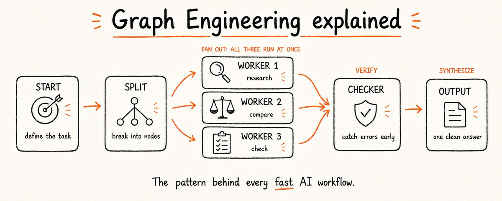
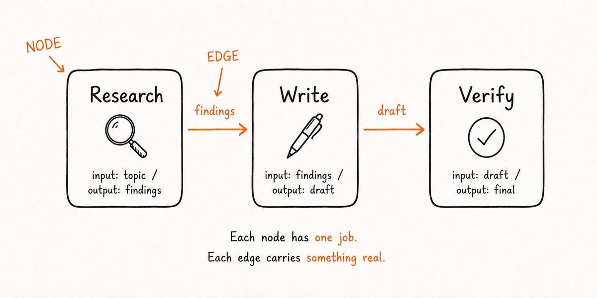
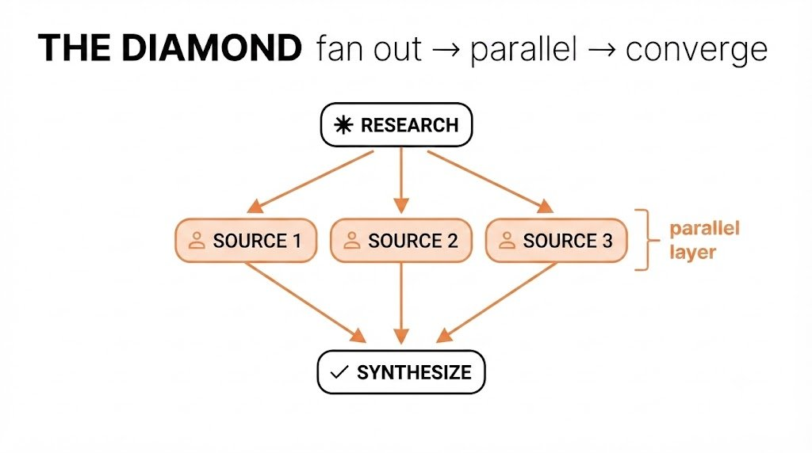
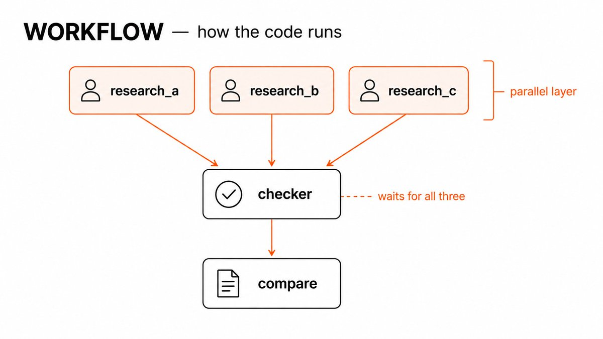

# 用 Claude 做 Graph Engineering：它是什么，以及如何真正用起来



几周前，整个 AI 圈还在聊 loops。然后 graphs 刷满了所有人的时间线，loops 一夜之间就成了旧闻。
转变来得很快。但网上关于 graph engineering 的内容，要么太含糊派不上用场，要么太技术让人跟不上。没人先讲清楚 graph 到底是什么，就开始催你去建一个。
读完这篇文章，你会明白 graph 究竟是什么、如何认出藏在你当前工作流里的 graph、让它们真正强大的那个单一模式、它们在哪里悄然失败，以及如何用 Claude 在几分钟内自己搭一个。

### Graph 到底是什么
多数人听到「graph」会想到柱状图或折线图。这里不是那个意思。在 AI 工作语境里，graph 比听起来更简单：它是一张地图，标出哪些任务需要完成，以及每个任务依赖什么。
整个东西由两样构成。
**Node（节点）** 是一个工作单元。一个 agent、一个任务、一样东西进去、一样东西出来。不是「把这个主题全研究一遍，再写摘要，顺便核对来源」——只做其中一件。任务越小、边界越清晰，节点就越有用。
**Edge（边）** 是依赖关系。当第二个节点真正需要第一个节点产出的东西时，边就把两者连起来。不是「这两件事按顺序发生」，只有当一方的输出真正喂给另一方的输入时才算。



就这些。节点做活，边搬运节点之间流动的东西。Graph engineering 里其余一切，不过是把这两个想法用在不同尺度上。

### 你当前的工作流已经是一张 graph
多数人第一次听说 graph engineering 时漏掉了这一点：你其实已经在做了——只是做得很差。
当你写这样的 prompt：「研究这个主题，然后总结发现，再根据摘要写草稿」——那就是一张 graph。一条不分叉的链，每一步都在等前一步做完。一个头、一条线、一次一件事。
它能正确跑起来。但也很慢，而且容易断。如果摘要那步产出了没法用的东西，草稿那步就挂了。如果研究那步拖太久，后面全在等。链没有冗余，也没有弹性——它是最简单的 graph，而简单不等于高效。
Graph engineering 的第一步不是学新东西。而是盯着你已有的东西问：是不是每一步都真的必须等前一步？因为大多数时候，并不需要。
❌ **线性链：**

> Research → Summarize → Write → Check sources → Format → Publish
六步排成一条线。每一步都在等。总时间：六步之和。
✅ **重画成 graph：**

> Research + Check sources（同时跑）→ Summarize → Write + Format（同时跑）→ Publish
同样的活。更少等待。独立任务不再互相排队，所以更快做完。

### 假边测试（fake-edge test）
一旦能把工作流看成 graph，下一步就是找出那些不该存在的边。
一步步看你当前的工作流。每到一个箭头，问一个问题：这一步是否真的需要前一步的结果？不是「它排在后面」——而是它是否真正用到了前一步产出的东西？
如果是，这条边是真的。保持顺序。
如果不是，就没有边。这两项工作彼此无关，中间的等待纯属浪费。
举个简单例子：「先审查文件 A 的 bug，再审查文件 B 的 bug。」读起来像顺序。但审查文件 B 从来不会看文件 A 返回了什么。它们一前一后跑，只是因为你按这个顺序打字。让它们同时跑，整件事会在较慢那一个的时间内完成——而不是两者相加。
对任何工作流跑这个测试，五分钟内就能完成：

1. 把每一步写成一个框
2. 在每对连续步骤之间画箭头
3. 对每个箭头问：步骤 A 的数据是否真的进入步骤 B？
4. 如果是——保留箭头。真依赖
5. 如果否——删掉箭头。那是假边
6. 没有入边的都可以立刻开始
7. 没有出边的是最终输出
> 几乎任何你画出来的工作流里，都会发现两三条假边。每一条都是你白白送出去的时间。

### 菱形（The Diamond）
一旦开始去掉假边，有一种模式出现得比任何其他都频繁。它叫菱形，正是让 graphs 值得用的那个形状。
想法很简单。一个节点扇出成若干并行节点。这些并行节点又都喂进一个最终节点，把它们的输出合在一起。画出来就像一颗菱形。



实际长什么样。假设你在研究一个主题准备写作。线性版本是这样：搜索 → 读来源 1 → 读来源 2 → 读来源 3 → 综合。
菱形版本：搜索 → [并行读来源 1 + 读来源 2 + 读来源 3] → 综合。
最终综合节点无论哪种方式拿到的输入都一样。但它等待的时间是最慢那次来源阅读的长度——不是三次加总。
菱形之所以成立，是因为综合确实依赖三次阅读。那些是真边。但三次阅读彼此没有依赖。那些连接不存在。所以你同时跑它们，唯一的等待发生在末尾——而那里的等待本来就不可避免。
这就是为什么一旦你开始留意，菱形会到处出现。研究流水线。代码审查。市场分析。只要工作里有「从多处收集，再合并」的形状，你就有一颗菱形。收集是并行的。合并是汇合点。
这个模式有两条规则。第一，并行节点必须真正独立——没有伪装成真边的假边。第二，汇合节点必须确实需要它们全部。如果它只需要一个，其余就是白干活。
两条都做对，菱形就是工作流能取到的最快形状。

### Graphs 在哪里悄然失败
菱形在理论上很干净。实践中它会在两个具体地方坏掉，而且都容易漏看。
第一是坏节点没被发现。三个来源并行跑，其中一个返回了垃圾——幻觉、空结果、读错文件——那份坏输出会和两份好的一起直通综合节点。
综合节点不知道其中一个输入是错的。它把一切合在一起，产出一份建立在坏材料上、却很自信的答案。让事情变快的并行结构，也去掉了你本来会注意到问题的自然检查点。
第二是级联。在线性链里，坏步骤产出坏输出，你立刻看得见。在有汇合路径的 graph 里，坏输出和好输出混在一起，错误更难追溯。等最终节点响应时，损害已经被稀释、看不见了。
两个问题的修法相同：加一个 checker 节点。
Checker 节点坐在并行层和汇合点之间。它唯一的工作是在输出继续向前之前评估每一份输出。它不综合、不写作、不做任何主线工作。它只问：这份输出能用吗？能用就放行。不能用就标记、重试，或在毒害下一步之前丢掉。
Checker 节点应抓住这五类问题：

1. 空或 null 输出——节点没返回任何有用东西
2. 彼此矛盾、不可能同时为真的输出
3. 相对原始任务跑题的输出
4. 置信信号过低、不可靠
5. 会弄坏综合节点解析的格式错误
> 没有 checker 节点的 graph，等于假设上游一切都成功了。这个假设失败的频率，比你预期的更高。

### 静态 graphs vs. 动态 graphs
到目前为止，一切都假设你在开始前就知道 graph 的形状。你定义节点、画边、然后运行。这对结构不变的可重复工作流有效。
但很多真实工作不适合那个形状。你开始一项研究，中途发现某个来源还需要三次额外查询。你开始代码审查，发现某个文件需要比其他文件更深的分析。你需要的结构在开始时不可知——只有工作进行中才变得清楚。
这就是动态 graphs 登场的地方。不是事先固定好的结构，而是 graph 在运行中自我构建。一个节点完成工作，看着自己发现了什么，再决定接下来该有哪些节点。Graph 不是被规划出来的——它是长出来的。
这个差别在实践中很重要。静态 graph 又快又可预测。你确切知道会跑什么、什么顺序、大概多久。动态 graph 灵活，能处理意外。但出问题时更难调试，因为实际跑过的结构不是你最初画的那张。
开始前弄清自己需要哪一种，能省掉大量回头路：

1. 任务可重复、结构每次相同 → 用静态 graph
2. 速度和可预测性比灵活性更重要 → 用静态 graph
3. 工作范围取决于沿途发现什么 → 用动态 graph
4. 某些节点需要根据输出决定下一步 → 用动态 graph
5. 永远先用静态 graph——只有撞上静态版处理不了的墙时，再切到动态
6. 任何需要审计「到底跑了什么、为什么」的场景，绝不用动态 graph
多数感觉「需要动态 graph」的工作流，其实只需要一张设计更好的静态 graph。动态版更强，也更难控制。第二次再伸手去拿它，而不是第一次。

### 差别实际长什么样
抽象理论容易跟上。这里用同一任务跑两种方式，让你看清真正变了什么。
任务：分析三款竞品并写一份对比。
没有 graph：
Research competitor A → Research competitor B → Research competitor C → Compare all three → Write draft → Check facts → Format output
七步，全是顺序。总时间是每一步之和。如果第二步比预期久，后面全在等。
有了 graph：
[Research A + Research B + Research C] → Checker node → Compare → [Write draft + Format output] → Final check
五个逻辑阶段。三次研究同时跑。写作和排版同时跑。Checker 在对比之前拦住坏研究。总时间大幅收缩。
输出一样。结构不一样。
各方法的得失在这里：

|  | Linear | Graph |
| --- | --- | --- |
| Setup time | Low | Higher |
| Total runtime | Slow | Fast |
| Easy to debug | Yes | Harder |
| Handles errors mid-run | Poorly | Well (checker node) |
| Works for one-off tasks | Yes | Overkill |
| Works for repeatable workflows | Yes | Better |
| Scales as task grows | No | Yes |

表格看起来像 graphs 除了搭建和调试之外处处赢。对你会跑不止一次的事，大致如此。对永远不会重复的一次性任务，线性版几乎总是更快搭起来、跑起来。
当任务大到时间节省会复利，或中间出错的代价高到 checker 节点能自我回本时，graph 才值得。

### 如何用 Claude 搭一个
上面这些在你给 Claude 可执行的东西之前，仍只是心智模型。这里开始变实用。
Claude Code 有一个 workflow 关键字，会改变它处理指令的方式。没有它，Claude 把你的 prompt 读成序列，一步接一步跑。有了它，Claude 解析结构，找出彼此无依赖的节点，并自动并行跑那些节点。你描述 graph。Claude 算出执行顺序。
一个基础 workflow 长这样：

```python
workflow: research-and-compare

nodes:
  research_a:
    task: "Research competitor A's pricing, features, and recent news"
    output: competitor_a.md

  research_b:
    task: "Research competitor B's pricing, features, and recent news"
    output: competitor_b.md

  research_c:
    task: "Research competitor C's pricing, features, and recent news"
    output: competitor_c.md

  checker:
    task: "Review each research file. Flag any that are incomplete or off-topic."
    depends_on: [research_a, research_b, research_c]
    output: checker_report.md

  compare:
    task: "Using the research files, write a structured comparison across price, features, and positioning."
    depends_on: [checker]
    output: comparison.md
```



注意三件事。第一，research_a、research_b、research_c 没有 depends_on——workflow 一开始 Claude 就同时跑这三个。第二，checker 把三者都列为依赖，所以等三者都完成才跑。第三，compare 只依赖 checker，不直接依赖研究节点——checker 是守门人。
那一行 depends_on 是你设计任何 graph 唯一需要理解的东西。无依赖意味着并行。有依赖意味着等待。其余一切只是决定哪些节点需要什么。

### 可直接粘贴的 prompts
上一节的 workflow 语法适用于任何可重复任务。这里有四个，可以直接丢进 Claude Code 再改改。
竞品研究：

```python
workflow: competitive-research

nodes:
  research_a:
    task: "Research [Company A]. Cover: pricing, core features, recent product changes, public sentiment. Output a structured summary."
    output: company_a.md

  research_b:
    task: "Research [Company B]. Cover: pricing, core features, recent product changes, public sentiment. Output a structured summary."
    output: company_b.md

  research_c:
    task: "Research [Company C]. Cover: pricing, core features, recent product changes, public sentiment. Output a structured summary."
    output: company_c.md

  synthesize:
    task: "Using company_a.md, company_b.md, company_c.md — write a comparison table and a one-paragraph positioning summary for each."
    depends_on: [research_a, research_b, research_c]
    output: comparison.md
```

多文件代码审查：

```python
workflow: code-review

nodes:
  review_auth:
    task: "Review auth.py for security issues, edge cases, and code quality. Be specific."
    output: review_auth.md

  review_api:
    task: "Review api.py for security issues, edge cases, and code quality. Be specific."
    output: review_api.md

  review_db:
    task: "Review db.py for security issues, edge cases, and code quality. Be specific."
    output: review_db.md

  checker:
    task: "Read all three review files. Flag any issues that appear in more than one file. Note cross-file dependencies that could cause problems."
    depends_on: [review_auth, review_api, review_db]
    output: checker.md

  summary:
    task: "Using all review files and checker.md, write a prioritized list of fixes — critical first, then medium, then low."
    depends_on: [checker]
    output: final_review.md
```

文章研究与草稿：

```python
workflow: article-research

nodes:
  angle_a:
    task: "Research [topic] from the angle of [audience A]. What do they care about most? What are the common misconceptions?"
    output: angle_a.md

  angle_b:
    task: "Research [topic] from the angle of [audience B]. What do they care about most? What are the common misconceptions?"
    output: angle_b.md

  examples:
    task: "Find 3 specific real-world examples of [topic] that most people haven't heard of. No generic case studies."
    output: examples.md

  draft:
    task: "Using angle_a.md, angle_b.md, and examples.md — write a draft that speaks to both audiences and opens with one of the specific examples."
    depends_on: [angle_a, angle_b, examples]
    output: draft.md
```

> 把方括号里的内容换掉。不管节点里写什么，结构保持不变。

### 用 graphs 思考之后会改变什么
前两节的 workflows 立刻就能用。但更大的转变发生在你用了几周之后。
你不再把任务读成待办清单，而是读成一组依赖关系。第一个问题不再是「我先做什么？」，而是「什么东西真正需要等什么？」大多数时候答案是：比你以为的更少。
变化也会体现在你怎么写 prompts。线性 prompt 按顺序告诉 Claude 做什么。Graph prompt 告诉 Claude 每一块需要什么，让它自己算出顺序。那是更短的 prompt，更好改，换掉一个节点也不会整段崩掉。
对任何你会跑超过两次的工作流，最后值得加的是一条 CLAUDE.md 条目。它告诉 Claude 在该项目里你希望 graphs 怎么处理——输出格式、checker 行为、错误处理的默认值，这样你不必每个会话重建上下文：

```python
# Workflow defaults

When running a workflow:
- All nodes without depends_on run in parallel by default
- Checker nodes should flag incomplete outputs, not silently pass them
- Output files go to /outputs with the node name as filename
- If a node fails, pause and report before continuing
- Never merge outputs from flagged nodes into the final synthesis
```

> 一个文件，设一次。该项目里你跑的每个 workflow 都会继承它。
你现在画的 graphs，六个月后会显得理所当然。不是因为它们简单——而是一旦你把依赖看得清楚，就再也忘不掉。任何工作流的线性版本开始显出本相：一张所有边都被伪造的 graph。

文章开头我说，网上关于 graph engineering 的内容要么太含糊要么太技术。我是认真的，也试着卡在中间那条缝里。
你现在知道 graph 是什么。知道如何找到藏在当前工作流里的那张。知道假边测试、菱形、checker 节点，以及何时该拿动态 graph 而不是静态。你有了在 Claude Code 里搭建的语法，还有四个今天就能用的 prompts。
这就是全部。在这些变得有用之前，你不需要更深一层的图论。
如果有人叫我别写进去、我会顶回去的一件事：假边测试。这周对一个工作流跑一次。就一个。画出步骤，过一遍箭头，问哪些真正在传数据。你至少会找到一条不是。
那一刻整个模型就通了。不是当你理解理论的时候——而是当你在自己搭的东西里找到第一条假边，意识到自己已经为它干等了好几个月。
其余的都会从那里跟上。
