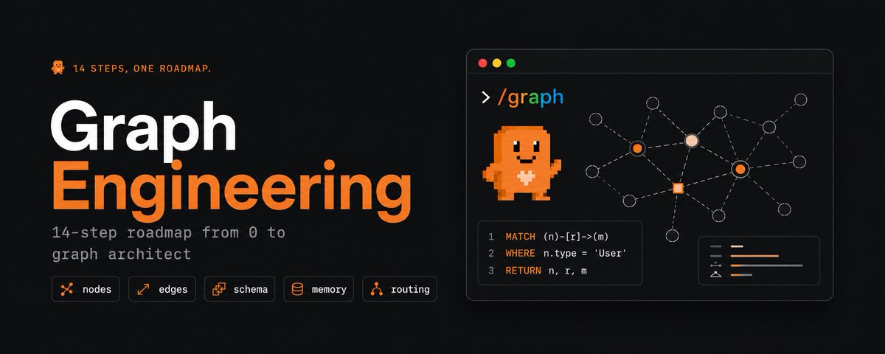
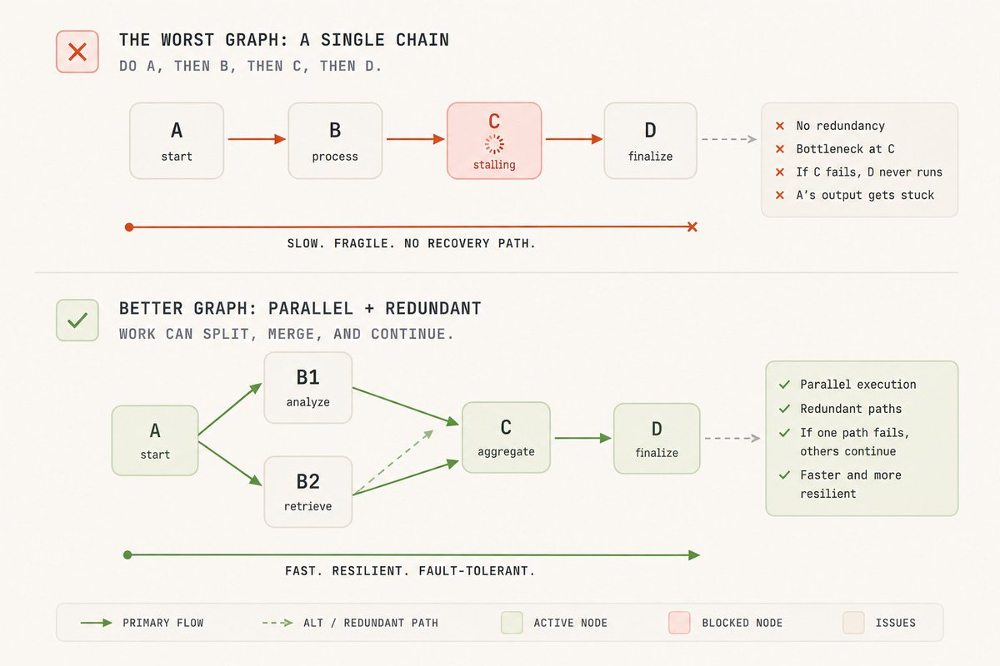
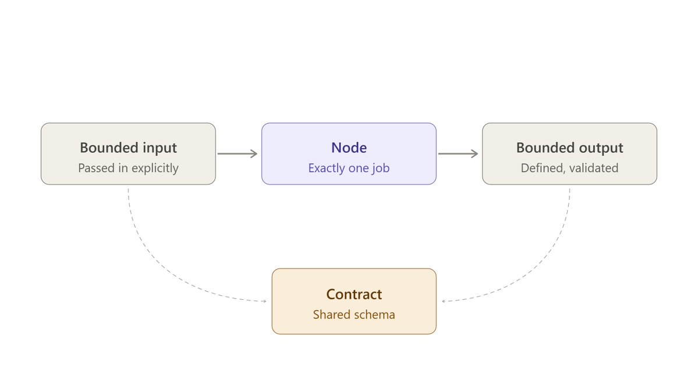
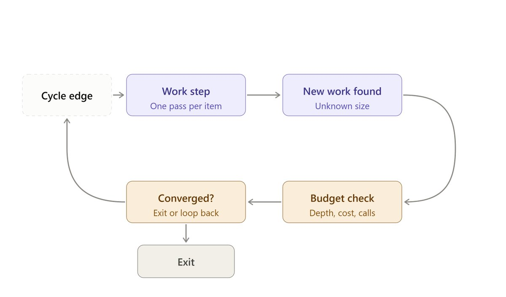

# Graph Engineering：别再把你的 Agents 串成链



作者 [seeco](https://x.com/seeconvm) (@seeconvm) — 2026-08-14（更新于 2026-08-14）

**我打开过的几乎每一个多步骤 agent，都是一条队列。第一步、第二步、第三步，每一个都礼貌地等上一个做完。而一旦你仔细看，大约一半的步骤其实根本没什么可等的。**

它们不路由。不分叉。不并排跑任何东西。它们只是排队站着，一个头、一个上下文、一次一件事，直到窗口被填满，agent 悄悄忘了自己一开始在干什么。

这里有一点没人替你点破。Prompt 是一句话。Loop 是一个循环。Harness 是你的 agent 站立的地板。但工作本身的形状——什么先跑、什么能同时跑、什么真的必须等其他一切——那个形状是一张 graph。节点负责思考。边搬运结果。

Claude Code 已经把直接搭建这些 graphs 的工具送上了线：动态 workflows。Claude 写一份普通的 JavaScript 编排脚本，然后拉起一支协调好的 subagents 舰队来执行。协调本身不消耗任何模型 token，因为它是代码，不是另一段对话。

这是我用来把单文件 agent 变成一张 graph 的 14 步路线图：扇出到一支舰队，检查自己的发现，落到一个单一 agent 根本装不下的结果上。


### 速览


1. 节点是任务。边是流动的东西。

2. 你的线性脚本已经是一张 graph，只是一张很差的。

3. 每个节点要有一份契约。

4. 每条边也要有数据契约。

5. 用 parallel() 扇出。

6. 在 barrier 处扇入，而且只在必须时。

7. 菱形：拆分、干活、合并。

8. 用条件在运行时路由边。

9. 在边上放一个 verifier。

10. 隔离节点，让一次失败留在局部。

11. 加一个 cycle，但要让它收敛。

12. 在节点之间分层使用模型。

13. 拓扑就是你的成本和延迟。

14. 让 Claude 帮你画 graph。


### 01. 节点与边，或者说为什么「然后」不是依赖


一张 graph 恰好有两样东西，把它们弄清楚就能消掉大部分困惑。

节点是一个工作单元。一个 agent、一份有界任务、一个输入进、一个输出出。

边是依赖。它说：这个节点的输出喂给那个节点的输入。定义就这么多。

几乎所有人都会犯的错，是把「然后」当成一条边。「总结这个文件，然后再告诉我天气」里 nowhere 都没有边。天气并不消费那份摘要。那是两个不相连的节点，被线性脚本毫无理由地串在一起。

该问的问题。对你 agent 里每一个「然后」：下一步是否真的读取了上一步的输出？如果没有，那里就没有边，等待纯属浪费。


```plaintext
Draw it as boxes and arrows. A box is one agent()
call. An arrow is a variable that leaves one call's
return and enters another call's prompt. If you cannot
draw the arrow, if no variable crosses, those two boxes
are independent. That independence is the thing you are
going to spend the rest of this article exploiting.
```


### 02. 你的线性脚本是一张退化的 Graph


当你把 agent 写成「做 A，然后 B，然后 C，然后 D」，你已经画了一张 graph。你画的是能拿到的最差那种：一条不分叉的链，每个节点正好一条入边、一条出边。

它能跑。但也很慢，而且坏起来很惨，因为链没有冗余。C 卡住，D 永远不会发生，A 产出的一切堵在上游无处可去。





这里第一个真正的技能是重画那条链。拿你的线性 agent，走过每一支箭头，问步骤 01 里的那个问题。实践中你会发现两三支箭头根本不传任何数据。它们存在，只是因为你碰巧按那个顺序打了字。

剪掉那些箭头，链会向旁边塌成宽得多的东西：一小撮可以同时跑的独立节点，再喂进一个需要它们全部的单一节点。


### 03. 给每个节点一份契约


你无法推理的节点，就无法并行化。修法是一份契约：有界输入、有界输出、恰好一份工作。

输入是该节点读取的任何东西，显式传入。绝不要假设来自它碰巧坐在其中的某个共享窗口。输出是一个定义好的形状，最好经过校验，这样下一节点消费时不必猜。





在 workflow 里你用 schema 强制这一点。当你把带 JSON schema 的 agent() 调用交给 Claude，它拉起的 subagent 被强制返回经过校验的结构化数据。校验发生在工具调用层，所以不匹配时 Claude 会重试，而不是塞给你一段还得解析、还得祈祷的自由文本。


```json
// A node with a real contract: bounded in, validated
out, one job.
const FINDING = {
  type: 'object',
  additionalProperties: false,
  properties: {
    title:  { type: 'string' },
    url:    { type: 'string' },
    impact: { type: 'string', enum: ['high', 'medium',
'low'] },
  },
  required: ['title', 'url', 'impact'],
};

const result = await agent(source.prompt, {
  label: `research:${source.key}`,
  schema: FINDING,          // forces validated
structured output
  agentType: 'general-purpose',
});
// result is now a shape the next node can trust, not
free text.
```


这就是 Claude 能接到 graph 里的节点，和只有人类读输出时才管用的节点之间的全部差别。


### 04. 边也是一份数据契约


边不是「B 排在 A 后面」。它是一份关于什么会穿过的承诺：A 产出这个形状，B 被建成消费这个形状。按数据而不是按顺序给边命名，两件事会容易得多。

你可以立刻判断这条边是否真实——意思是数据是否真的在上面流动。只要形状成立，你也可以换掉任意一端的节点而不动 graph 其余部分。

实践中，边活在普通 JavaScript 里。扇出和综合之间的 reduce 步骤——flatten、dedupe、filter——只是对节点返回形状操作的代码。

不需要 agent。这是用 graphs 思考的安静红利之一：人们烧掉大量模型 token 的东西，其实往往只是一条边，而边是免费的。


```json
// Tempting: spawn an agent to "combine the results.
"Don't.
// If combining means flatten and dedupe, that is flatMap
plus a Set.
// Deterministic, instant, zero tokens.
const flat  = collected.flatMap((c) => c.items);
const clean = [...new Map(flat.map((i) => [i.url, i])).
values()];
```


把 agents 留给判断。别留给管道工程。每条边都是一个 agent 的 graph，等于在为自己的接线交房租。


### 05. 用 parallel() 扇出


这是让其他一切回本的那一招。当你有 N 个独立节点——N 个来源要查、N 个文件要审、N 条路由要审计——你不要把它们串起来。

你告诉 Claude 扇出去，一次跑完。在 workflow 里那就是 parallel()：Claude 拿一组 thunk，每个 thunk 拉起一个 subagent，并发跑，再把结果数组交还给你。

两个细节让它稳健。第一，parallel() 是一个 barrier，所以它等每个 thunk 都回来才返回，下一阶段总能看到完整集合。第二，抛错的 thunk 会 resolve 成 null，而不是拒绝整批，所以一个不稳的 agent 拖不垮整次运行。

出去时永远 .filter(Boolean)。并发上限大约是你的核心数，溢出会排队，所以你可以丢给它一百个 thunk，它们都会做完，只是一次一小撮。


```json
phase('Research');

// Nine sources, nine agents, all at once.
const raw = await parallel(
  SOURCES.map((s) => () =>
    agent(s.prompt, {
      label: `research:${s.key}`,
      phase: 'Research',
      schema: ITEM_SCHEMA,        // each node returns
validated JSON
      agentType: 'general-purpose',
    }),
  ),
);

const collected = raw.filter(Boolean);  // drop nulls
from failed agents
```


扇出活在 Claude 写的代码里，不在模型对话里。Claude 自己的上下文从不一次装下九个来源。每个 subagent 带着自己的上下文，只有最终答案回来。这就是为什么 workflow 能扩到几十上百个 subagents 而不淹死会话，而编排层零成本——因为它不是 Claude 又一轮思考。


### 06. 在 Barrier 处扇入


扇出只有在有东西把它收拢时才值钱。扇入是边汇合的那个节点，一个 agent 或一段代码同时看到所有上游结果，并做一件真正需要整套结果的事：跨来源去重、按影响排序、若全部为空则提前退出。

那是 barrier 唯一配得上它挂钟成本的地方。

让 graphs 保持快的规则：只有当某阶段真的需要把先前所有结果放在一起时，才用 barrier。跨所有来源去重算。


```json
// The edge: plain JS, no agent, zero tokens.
const flat = collected.flatMap((c) => c.items);
log(`Collected ${flat.length} items`);

phase('Curate');
// The barrier node: needs the WHOLE set to dedupe and
rank.
const curated = await agent(
  `Dedupe and rank these by impact:\n${JSON.stringify
(flat)}`,
  { phase: 'Curate', schema: CURATED_SCHEMA },
);
```


只是把列表压平不算 barrier，那是边，就地做。嗅觉测试残酷而简单：如果你写了 parallel，然后一个变换，再 parallel，而中间那个变换没有跨条目依赖，你本该用 pipeline，完全跳过 barrier。


### 07. 菱形：拆分、干活、合并


把扇出和扇入放在一起，就得到每张认真 agent graph 的主力拓扑：菱形。

一个节点拆分任务。许多节点并行干活。一个节点合并。这是市场扫描、依赖审计、代码审查、研究报告背后的形状。换掉来源和 prompts，同一骨架适配全部。

规范形式值得背下来：扇出、reduce、综合。扇出去拿广度。用普通代码 reduce 压缩。用最终 agent 综合写出答案。

一旦你能看见菱形，你就不再问「怎么让我的 agent 多做几步」，而开始问「拆分在哪，合并在哪」。第二个问题才是真正能扩展的那个。


### 08. 用条件在运行时路由边


不是每张 graph 都是固定的。有时你走哪条边取决于节点发现了什么。路由节点检查结果，决定哪条下游路径开火：给工单分类，再分支到正确处理器。检查 diff 大小，然后要么快速审查，要么拉起完整审计。

在 workflow 里，这只是对节点已校验输出做的 JavaScript if 或 switch，因为控制流活在代码里。


```json
// Router node: an agent classifies, code picks the edge.
const { severity } = await agent(`Classify this diff's
risk:\n${diff}`, {
  schema: {
    type: 'object',
    properties: { severity: { type: 'string', enum:
['low', 'high'] } },
    required: ['severity'],
  },
});

let review;
if (severity === 'high') {
  // heavy path: full parallel audit
  review = await parallel(FILES.map((f) => () => agent
(`Audit ${f}`)));
} else {
  // light path: one quick pass
  review = await agent(`Quick review of ${diff}`);
}
```


这就是确定性从局限变成特性的地方。路由节点的决策可以是 Claude 驱动的，由 subagent 分类。路由本身是 Claude 写的代码，所以对同一分类每次都以同样方式运行。

你在节点上拿到 Claude 的判断，在边上拿到脚本的可靠性。不会出现「Claude 今天决定跳过审计」这种涌现意外，因为跳过必须写进 graph，而它没被写进去。


### 09. 在边上放一个 Verifier


Graph 真正的杠杆不是你得到更多 agents。而是你可以围着它们包一层结构来产出信心。

Verifier 节点坐在边上，在结果被允许下游之前，它唯一的工作是试图杀死那条发现。若它活下来，就放行。若没活下来，它永远到不了你的答案。

三种值得握在手里的模式：

- 对抗式验证。对每条发现，拉起 N 个被提示去反驳它的独立怀疑者，只有多数存活才保留。

- 视角多样验证。给每个 verifier 自己的镜头——正确性、安全性、能否复现——因为多样性能抓住 N 次相同检查永远抓不到的失败模式。

- Judge panel。从不同角度生成 N 次尝试，用并行 judges 打分，从赢家综合，同时嫁接亚军们最好的部分。

正是这种模式，让一个真实团队在把 Bun runtime 移植过来时，把对抗式代码审查直接烤进了 loop。


### 10. 隔离节点，让一次失败留在局部


在链里，失败会级联。C 挂了，D 不跑，整件事停住。在 graph 里，失败应被限制在它的节点。

这一点部分已经成立：parallel() 里抛错的 thunk resolve 成 null，所以八个好 agents 仍返回，坏的那个掉出去。你的 .filter(Boolean) 就是遏制。设计每个扇入去容忍缺失输入，而不是假设集合完整。

更隐蔽的失败是节点互相踩脚。当 agents 并行写文件时，它们会冲突。

修法是隔离：worktree。每个 agent 在自己的 git worktree 里跑，在沙箱里干活，最后干净合并。只有节点真的并行写时才用它。它是某一特定拓扑的安全带，不是每次运行的默认税。


### 11. 加一个 Cycle，但要让它收敛


有时你要进到里面才知道工作有多大。未知规模的发现。一次 bug 清扫，找到一个又露出三个。那需要一个 cycle——一条受控的边回到更早的节点。

危险显而易见。永不收敛的 cycle 是无限 loop，会一直拉起 agents 直到预算耗尽。





能收敛的模式是 loop until dry：不停拉起 finders，直到连续 K 轮没有新东西浮出，然后停。而这是决定成败的细节，几乎所有人第一次都会搞错：你要对什么去重。

对「见过的一切」去重，而不只是对已确认结果。否则被拒绝的发现每轮都回来，loop 永远干不了，你就造了一台永远花钱重新发现同一条死路的机器。


```json
const seen = new Set(); const confirmed = []; let dry = 0;

while (dry < 2) {                        // stop after 2
empty rounds
  const found = (await parallel(
    FINDERS.map((f) => () => agent(f.prompt, { schema:
BUGS }))
  )).filter(Boolean).flatMap((r) => r.bugs);

  const fresh = found.filter((b) => !seen.has(key(b)));
  if (!fresh.length) { dry++; continue; }   // nothing
new, closer to dry
  dry = 0;
  fresh.forEach((b) => seen.add(key(b)));   // dedupe vs
SEEN, not confirmed

  // diverse lens verify: every fresh finding earns its
place
  const judged = await parallel(fresh.map((b) => () =>
    parallel(['correctness', 'security', 'repro'].map
((lens) => () =>
      agent(`Judge "${b.desc}" via ${lens}. Real?`, {
schema: VERDICT })))
      .then((v) => ({ b, real: v.filter(Boolean).filter
((x) => x.real).length >= 2 }))
  ));

  confirmed.push(...judged.filter((v) => v.real).map((v)
=> v.b));
}
```


### 12. 在节点之间分层使用模型


不是每个节点都需要你最好的模型。Graph 以单一 agent 永远做不到的方式把这点说得很清楚：有些节点有界且重复——提取这个字段、给这张工单分类。另一些承载真正的判断——综合报告、裁定发现。

把无聊节点跑在更便宜的模型上，把昂贵 token 花在判断真正所在的地方。

在 workflow 里，Claude 拉起的每个 subagent 默认继承你的会话模型，除非脚本覆盖它，所以默认情况下一次大运行会全部按你的会话档位计费。单个 agent() 调用上的 model 选项告诉 Claude 只把那个节点路由到别处。

大运行前检查 /model，然后让 Claude 把扇出里的重复节点降到更便宜的模型，同时把合并节点留在顶上。这是那根杠杆，能把一张饿 token 的 graph 变成经济的一张，而完全不动它的形状。

### 13. 拓扑就是你的成本与延迟
Graph 的形状不是装饰。它是你对挂钟时间最大的那根杠杆。几乎所有人都会绊倒的选择是 parallel() 对 pipeline()。

parallel() barrier 让一切等最慢的节点，下一阶段才能开始。pipeline() 让每个条目独立流过所有阶段，没有 barrier，所以条目 A 可以坐在阶段 3，而条目 B 还在阶段 1。快的条目早早做完，而不是在慢的后面空转。

默认用 pipeline()。只有当某阶段真的需要一次性拿到先前所有结果时，才伸手去拿 barrier：跨集合去重、基于总量的提前退出、把一条发现与所有其他对比的 prompt。

「代码更干净」和「阶段感觉分开」不是理由。Barrier 延迟是真实的、可测量的、浪费的时间。分开不等于同步。


| Shape | Use it when | What it costs you |
| --- | --- | --- |
| Chain | Each step really reads the last step's output | Slowest possible run, one stall kills everything |
| `parallel()` fan out | N independent jobs, and the next stage needs them all | Everyone waits for the slowest node |
| `pipeline()` | N independent jobs flowing through the same stages | Almost nothing, this is your default |
| Diamond | Breadth first, then one merged answer | One barrier, at the merge, where it is earned |
| Conditional | The path depends on what a node found | A classification call before the branch |
| Cycle | You don't know how big the job is | Runaway spend if it never converges |


### 14. 让 Claude 帮你画 Graph


最后一招是：对你无法提前规划的工作，停止手工画 graphs。

有了动态 workflows，你描述目标，Claude 自己写编排脚本：分解任务、选择扇出、拉起协调好的 subagents 舰队，再综合结果。你最终得到一张为**这一次**运行量身定制的 graph，而不是一张你希望能凑合的固定图。

有三种入口。

在 prompt 里说出 workflow 这个词，Claude 就会为任务写一份。

跑一份已保存或内置的。/deep-research 是一张此刻就在生产里跑的真 graph：定范围、并行搜索、抓取、对抗式验证、综合。那正是本文的骨架。

打开 ultracode，Claude 会为会话里每个实质性任务规划一份 workflow。当一次运行结果不错，按 s 把它的脚本存进 .claude/workflows/。现在它受版本控制、可按名重跑，任何克隆仓库的人都能启动这张 graph。


```plaintext
> Run a workflow to audit every route under src/routes/
for missing auth.
  Spawn one agent per route file, then verify each
 finding before reporting.

• Claude wrote an orchestration script · launching in
background...
  /workflows > auth-audit · running
  ✓ Scope 1/1 2.1k tok · 4s
  ✓ Fan-out 18/18 one agent per route file
  ○ Verify 11/18 3-vote skeptics per finding...
  ○ Synthesize 0/1 waiting on verify
  session stays responsive, keep working while the fleet
runs
```


### 本周值得搭建的六张 Graphs


- 覆盖每条路由的安全清扫。每个路由文件一个 subagent，各自猎找缺失的 auth 检查，再过一轮 verifier，确认每条发现才进报告。那是单一上下文装不下的广度。

- 用 /deep-research 做带引用的报告。Claude 把你的问题拆成不同角度，并行跑搜索，对来源去重，再用三票怀疑者对抗式验证每条主张，然后才写一个字。

- 按文件移植一个模块。Bun 的天花板，缩放到你的仓库。Claude 把翻译扇出到各文件，把测试套件当作每个文件的闸门，把失败 loop 回去，对抗式审查抓住单次通过本会带着坏东西发货的部分。

- 对 diff 做对抗式审查。Claude 按 diff 大小路由：小改动走一次快速审查，大改动触发带不同镜头 reviewers 的完整并行审计，再由 judge panel 综合裁决。

- 按计划做的生态扫描。存一次，永远重跑。Claude 并行检查多个来源——发布、博客、讨论——在 barrier 处按影响排序，写出摘要。版本控制在 .claude/workflows/，可按名启动。

- 未知规模的发现任务。你不知道里面有多少 bugs。Claude 并行跑 finders，对新发现相对见过的一切去重，验证幸存者，继续 loop 直到连续两轮没有新东西。


### 为什么这真的重要


每一步都指向同一件底层的事。你的 agent 的天花板几乎从来不是模型。而是你交给它的工作形状。

链强迫一个上下文装下一切、一次失败停掉一切、每个快步骤都等在最慢的后面。Graph 把上下文摊到一支舰队上，把失败遏制在节点，并给你能包住信心的结构：节点上的 schemas、边上的 verifiers、每次都以同样方式跑的路由。

而编排层是代码。这是人们低估的部分。十八个 agents 之间的协调消耗零模型 token，因为脚本不是对话。


### 这里真正要紧的


如果你只从本文带走三件事：剪掉不传数据的箭头，默认用 pipeline() 而不是 barrier，以及对见过的一切去重而不是对已确认的一切。

仅这三样，就会让你的 agents 比往队列里再加一步更快、更便宜、更难弄坏。

线性 agent 从来不是天花板。它只是大家第一个伸手去拿的形状，因为它匹配我们打字的方式。一行、一个头、一次一件事。

写 prompt 的人问问题。架构师画 graph。

**那么你现在的 agent 是什么，一条线还是一张 graph？**

**如果你读到这里，这个话题远不止十四步和几段代码块。**

[@seeconvm](https://x.com/seeconvm) 是我持续拆解的地方。

更多内容即将到来。
