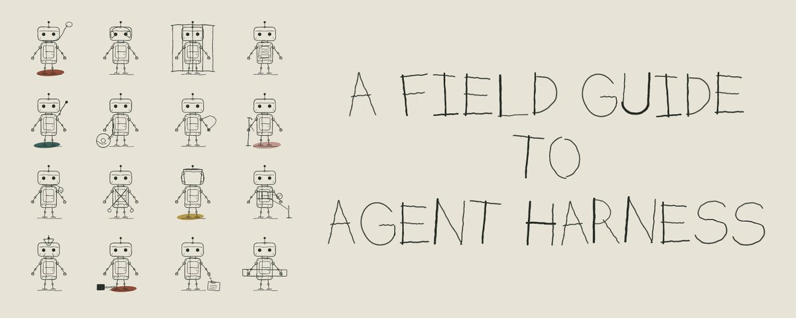
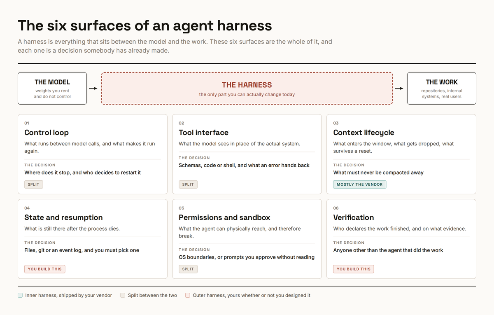
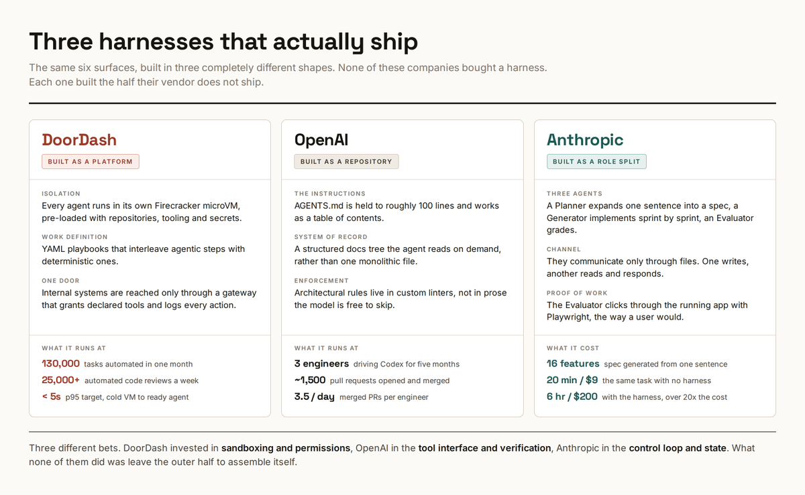
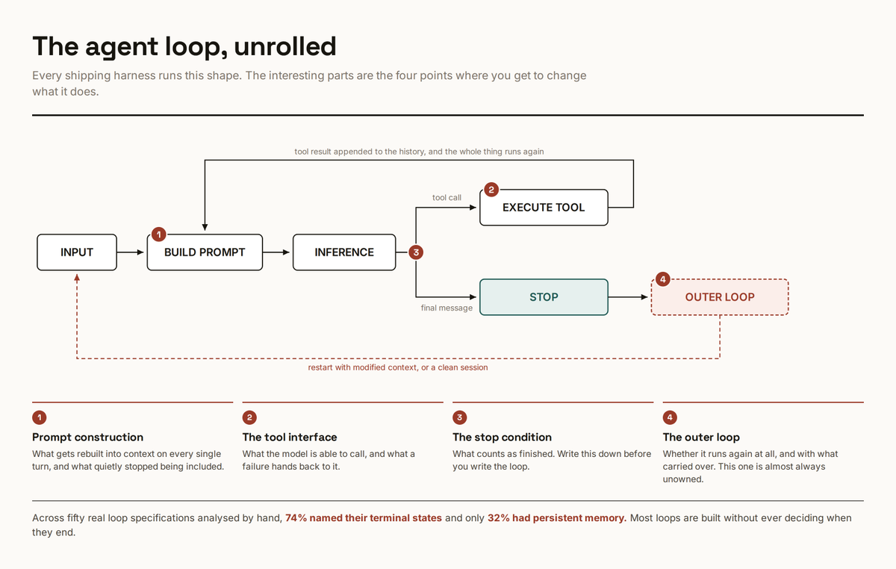
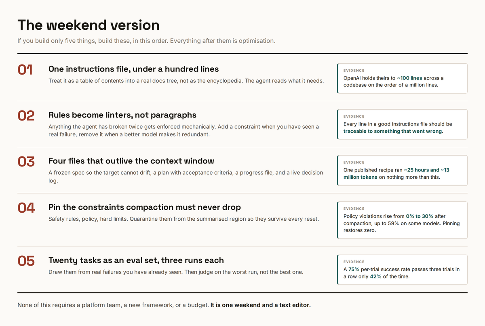

# How to Design an Agent Harness: six decisions that turn a model into a worker you can leave alone

- **Author:** Yarchi (@undefinedKi)
- **Source:** https://x.com/undefinedKi/article/2088611136027361368
- **Published:** 2026-08-15 (updated 2026-08-15)
- **Archived:** 2026-09-08 (verbatim original + images)

Your agent says the job is done and the tests never ran. It's sharp for twenty minutes, then forgets a rule you gave it at the start. You retype the same three instructions every session. You can't walk away, because there's always another approval waiting to be clicked.

A better model fixes none of it. All of that lives in the software wrapped around the model: what it gets told, what it keeps, what it's allowed to touch, and who checks the result. That wrapper is the harness. You already have one. The only question is whether anyone designed it.

## What is Agent Harness

Six things sit between the model and the work:

The loop that keeps it going, the tools it can call, what stays in its memory, what survives a crash, what it's allowed to touch, and who decides the job is done.

Half of that came in the box. Your vendor built the loop, the built-in tools, and the memory handling, and you can't change much of it. The other half is yours: your instructions file, your tests, your permissions, your definition of done. That half exists whether or not you ever thought about it. Every rule you keep retyping into chat is part of it.

People started calling this layer "the harness" in early 2026. Before that it had no agreed name, which is most of why it went unmanaged for so long.

## Real use cases

DoorDash built theirs as a platform. Every agent runs in its own throwaway virtual machine that boots with the repos, tools and credentials already in place. The work itself is written as YAML playbooks that mix agent steps with ordinary scripted steps. Everything reaching an internal system goes through one gateway that hands out only the tools a playbook declared and logs every call. They ran 130,000 automated tasks in a single month, including over 25,000 code reviews a week.

OpenAI built theirs as a repository. No platform at all. They treat the repo as the harness: the instructions file is kept to about 100 lines and works as a table of contents into a real docs folder, and architectural rules are enforced by custom linters instead of written as prose the model can skip. Three engineers merged roughly 1,500 pull requests in five months this way.

Anthropic built theirs as a role split. Three agents with different jobs. One turns a single sentence into a spec. One implements it. One drives the finished app in a browser and grades it. They communicate only by writing files to each other. It works, and it cost 6 hours and $200 where the unharnessed run took 20 minutes and $9. Over twenty times the price for a much better result, which is the trade nobody advertises.

Three completely different shapes. What they share is that none of it came in the box.

## The six decisions

This is the part that pays. Each one is short: what it is, exactly what to do, what it's worth, and when to skip it.

### 1. The loop, and where it stops

Your harness sends the model your task plus everything that has happened so far. The model replies with either a request to run a tool or a final message. If it's a tool request, the harness runs it, glues the result onto the history, and sends the whole thing again. Repeat until the model stops asking for tools. That's the entire loop, in every product on the market.

The vendor owns that inner loop. What's yours is everything around it: what happens when it stops, and whether it starts again.

Do this:

1. Write your stopping rule in one sentence, before you start. "Done means the test suite passes and the app boots." Not "done means the agent says it's done," which is what you have right now by default.

2. Decide what happens on a bad ending. A run that stops halfway either restarts with a note about what failed, or freezes and waits for you. Pick one. Having no answer means the agent silently invents its own.

3. Put a hard cap on it. Number of turns, or wall-clock minutes. An agent that has taken forty passes at the same file is not going to fix it on the forty-first, and it will happily keep spending your money trying.

4. If you run it unattended, log every turn to a file you can read afterward. You will need it, and reconstructing a six-hour session from memory is impossible.

Someone went through fifty published agent loops by hand. Only 74% even stated what counted as finished, and only 32% kept any memory between runs. This is the cheapest fix on the list and the one most often skipped.

### 2. The tools it can see

The model can't see your systems. It sees a menu of function descriptions, and that menu is the entire world as far as it's concerned. Two things about that menu are worth your attention.

Do this:

1. Stop loading every tool up front. If you have several MCP servers connected, every one of their tool descriptions gets stuffed into context on every single turn, whether or not the task needs them. The fix is to put the tools on disk as files and let the agent open only the ones it needs. Anthropic published a worked version of this: 150,000 tokens down to 2,000.

2. Rewrite what your errors say. Most tools fail with a sentence written for a human: "invalid request." That tells the model nothing, so it guesses, and usually guesses wrong. Return structure instead: which field was wrong, what a valid value looks like, and what to try next. Siemens measured this properly and got a 37 to 40 point jump in task completion, at roughly half the tokens per success.

3. Cut the menu down. Go look at how many tools your agent currently has access to. Anything you haven't seen it use in a month, remove. Two tools with confusingly similar names cost you more than a missing tool does.

4. Watch out if you build custom tools: how you name and group them measurably changes behaviour. Prefixes and suffixes are not cosmetic.

Skip it if you're running one agent on one repo with the built-in tools only. The token savings are real but they're not your bottleneck yet.

### 3. What stays in memory

Everything the model knows about your task lives in one buffer. When the buffer fills, older material gets summarised and thrown away. You don't pick what goes, and the model doesn't tell you it happened.

Do this:

1. Don't fill it. On a million-token model, work up to 300,000 or 400,000 and then stop. Past that the failures stop looking like confusion and start looking like carelessness, the kind where it deletes a config file it should have left alone.

2. Trim on purpose, at points you pick. Instead of letting auto-compaction fire mid-task, structure the work in stages: research, then a written doc, then a plan, then implementation. Start each stage in a clean window with only the previous stage's document. You read the document between stages. Slower, and much more reliable.

3. Pin the rules. Separate facts from rules. Facts can be summarised away. Rules cannot: never touch production, never commit secrets, this API contract is fixed. Put those in a file the agent re-reads after every reset and repeat them in the system prompt. Belt and braces, deliberately.

4. Restart when it starts agreeing with you. If the model has accepted five suggestions in a row without pushback, the session is done. Something wrong got in early and everything after treats it as established fact. Start a fresh window.

One study measured how often an agent broke a written policy rule and found violations going from zero, with the rule in full view, to 30% after compaction, and to 59% on the worst model. Where the rule survived summarising, violations stayed at zero. Pinning it fixed the problem completely. That paper is a single author and unreviewed, so treat the number as a strong hint rather than a fact. The fix costs an afternoon either way.

### 4. What survives a crash

Your agent will die mid-task. The window fills, the process crashes, you close the laptop. Whatever lived only in the conversation is gone.

Do this. Four files in the repo, and the agent is told to keep them current:

1. SPEC.md. What you're building. You write it, the agent never edits it. This is what stops the target drifting over a long run.

2. PLAN.md. The steps, each with a plain acceptance criterion. Not "improve error handling." Rather "requests to /orders with a missing id return 400 with a message, and the test asserting this passes."

3. PROGRESS.md. What's finished, what's next, what was tried and failed. This is the file a fresh agent reads first.

4. DECISIONS.md. Append-only. Every choice made and why. Without it a later session re-litigates a decision you already made two hours ago.

Then make the agent commit after every change that works. Small commits with real messages. Rollback becomes `git revert`, review becomes reading diffs, and you get a full history for free instead of building a checkpoint system.

If you're building something with many separate features, add a fifth file: a plain JSON list of every feature marked passing or failing. It's the cheapest progress tracker there is and the agent can update it itself.

if it isn't in a file, it doesn't exist.

### 5. What it's allowed to touch

An agent running on your laptop has your SSH keys, your VPN session, and every CLI you're logged into. It doesn't need to be malicious for that to end badly. It needs one poisoned web page in its context.

Do this:

1. Two boundaries, at the operating system level. Restrict which directories it can write to, and route its network access through a proxy with a list of allowed domains. Do it at the OS level rather than inside the agent, so that anything it spawns is covered too. An agent that shells out to a script that shells out to curl has escaped an in-app restriction and has not escaped this one.

2. Stop trusting approval prompts. People approve 93% of them. A prompt you always click through is not a security control, it's a delay you built for yourself. Use prompts for the handful of things you would genuinely stop for, and boundaries for everything else.

3. If several people run agents against shared systems, put one gateway in front of those systems. It hands out only the tools a job declared it needs and logs every call. That log is what makes an incident investigable instead of mysterious.

4. Never put long-lived credentials in the sandbox. Short-lived tokens, scoped to one job. If the agent can read a key, assume the key is in a context window somewhere.

Anthropic reported that adding proper sandboxing cut permission prompts by 84% internally. That's the real argument: it isn't only safer, it's much less annoying, which is why it actually sticks.

### 6. Who says it's done

The agent that wrote the code is the worst available judge of whether the code works. It graded itself, and it grades generously.

Do this:

1. Review in a separate session. Fresh window, no memory of having written the thing. The same model is fine. What matters is that it isn't carrying the reasoning that produced the bug.

2. Make it actually run the thing. For a web app, drive it in a real browser. For a CLI, execute the command. Reading a diff and pronouncing it correct is not verification, it's a second opinion on the same guess.

3. Build an eval set out of failures you've already had. Twenty to fifty tasks is plenty to start. Real ones, from your repo, that you have watched an agent get wrong.

4. Run every task three times and judge the worst run. This matters more than it sounds. A 75% success rate per attempt means all three attempts pass only 42% of the time. Agents are non-deterministic and a single green run tells you almost nothing.

5. Watch for the confident wrong answer. The characteristic agent failure is not a crash. It's hitting an error and writing a fluent paragraph about why it doesn't matter. In one production study, around 70% of these were caught by a human noticing, not by any test. Grep your logs for explanation-shaped text near error handling.

There is no published data on retry policy. How many times to retry, with what backoff, whether to retry at all or restart clean. Everyone has an opinion, nobody has numbers. If you find yourself tuning this for days, know that you're in genuinely unmapped territory.

## The weekend version

If you build five things and nothing else, build these, in this order.

1. One instructions file, under a hundred lines. A table of contents into a real docs folder, not an encyclopedia. Long instruction files get skimmed exactly like long emails.

2. Anything broken twice becomes a linter. Not a paragraph of prose asking nicely. A rule that fails the build. Add one when you've seen a real failure; delete it when a better model has made it pointless.

3. The four files. Spec, plan, progress, decisions. Plus a commit after every working change.

4. Pin the rules that must never be summarised away. Safety, policy, hard limits.

5. Twenty tasks, three runs each, judged on the worst one.

Everything past this is optimisation.

## Conclusion

You don't get to opt out of having a harness. You have one right now. It's whatever accumulated: every workaround added at 2am, every rule pasted into a config and forgotten, every permission clicked through because clicking was faster than reading. The decisions in it all got made. Just not by you.

And it isn't free. Anthropic's own harnessed run cost more than twenty times the unharnessed one. That's the actual question to answer before you start: a harness earns its keep on work you couldn't hand off at all, and never on work where you were trying to save twenty minutes.

Start with the stopping rule and the four files. Both are an afternoon. Both survive the next model release, which is more than most of this will.
