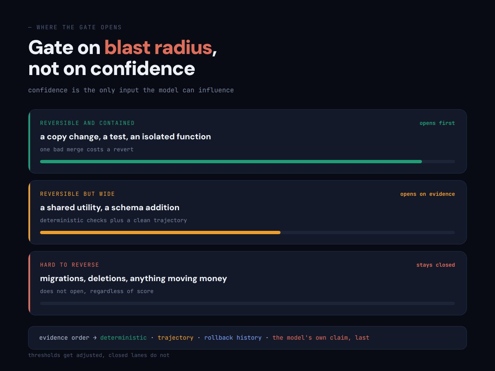

你检查 agents 走的每一步。不是因为你想，而是因为没有别的东西会检查。

离开那把椅子需要两样东西，而几乎所有人只建了其中一样。

Loop 让一个工作单元在你不在时也能正确。Graph 决定究竟存在哪些单元。

下面是二者的切分、那些并不显然的机制，以及你只批准一件事而不是所有事的那个点。

---

### Loop 是一次可以失败的检查

剥掉其余一切，loop 有四部分：产出、检查、纠正、重复直到变绿。

检查就是全部。

如果没有什么东西能在你不在房间时让工作失败，你就没有 loop。你只有一个调度器。

这听起来很显然，但几乎没人先写检查。

他们先建工作，再在末尾螺栓上一道审查，而审查是另一个模型被要求看一眼输出。

两个乐观主义者达成一致。

**先写条件，而且写成程序能判定的样子：**

```text
GREEN    the test suite exits 0
GREEN    every claim carries a source line
GREEN    the diff touches only files listed in the plan
```

```text
NOT A CHECK   the output looks good
NOT A CHECK   the model says it is confident
NOT A CHECK   no errors were raised
```

最后一条会抓住仔细的人。没有错误不等于正确性的证据。

在它上面建 loop，你会得到一个自信地重复错误直到预算耗尽的系统，日志一路干干净净。

---

### 没人警告你的天花板

Loop 让一个工作单元更好。那是它的全部工作，而且它非常擅长。

它无法决定存在哪些单元，或它们的顺序，也注意不到五个步骤里有两个其实从不需要彼此等待。

于是你得到一个非常好的 agent，按错误的顺序、一次一个地跑着错误的三步。

每一步都正确。结果仍然慢，形状仍然错，调 loop 也修不好，因为故障不在任何一个单元里面。

那是人们开始怪模型的时刻。也是下一层开始回本的时刻。


### Graph 是上面那一层

**Graph 是工作的形状：**什么跑、什么同时跑、什么等待、什么根本不跑，以及结果回到哪里。

两样东西，没有别的。节点是一个工作单元：一份有界任务，一个输入进，一个输出出。

边是依赖，这个节点的输出喂给那个节点的输入。

每一次不必要等待背后的错误，都是把「然后」当成一条边。

总结文件然后再查天气，两者之间没有边。天气并不消费那份摘要。

那是两个独立节点被线性脚本串起来，串法来自你打字的顺序。

**所以对你已有流水线里的每一支箭头跑这个：**下一步是否真的读取了上一步的输出？

如果你叫不出穿过的那个变量名，就没有边，等待纯属浪费。

多数链里有两三支这样的箭头，找到它们通常是能拿到的最大单次加速。

> **五层的完整拆解，按它们真正重要的顺序，在这里：** [agent-layers.vercel.app](https://agent-layers.vercel.app)

### 四种节点，其中一种不是模型

Splitter、worker、code node、gate。这就是全部词汇。

Splitter 把工作切成单元，坐在最前面。

它比任何其他节点决定得更多，因为按错误维度切分会浪费下游的一切。

按文件夹切仓库，四个 workers 会审计同一批三个文件。

按爆炸半径切，每一个都会看到其他看不到的东西。

Workers 各做一单元，各带一个镜头，各在自己的上下文里。最后那一点总被跳过。

给四个审计员一个共享窗口，他们会收敛：第一个写下发现，其余人读到它，四份报告都围着同一件事转。

**你为一种意见和三个回声付了四倍钱。**

Code node 是人们忘记存在的那一种。合并、排序、去重、在前后比较每一个导出。

这些都不是推理。每一个恰好有一个正确答案，每一个是几行代码，把它丢过模型只是给本来没有成本、延迟和方差的步骤加上这些东西。

如果你能在不使用「判断、决定、评估或总结」这些词的情况下描述变换，它就是代码。

每条边都是一个 agent 的 graph，等于在为自己的接线交房租。


### Loop 实际住在哪里

一句话解开全部困惑。Loop 住在节点里面。Graph 住在节点之间。

**在一个单元内：**产出、检查、纠正、重复直到变绿。

**在单元之间：**拆分、扇出、合并、闸门、送回。第二份清单里没有任何一项能从单一单元内部表达出来。

所以你不选择。节点里没有 loops 的 graph，会并行产出未经验证的工作，这比串行更糟，因为量更大。

外面没有 graph 的 loop，是没人设计过的队列里非常好的一步。

### 两条返回路径，以及人人跳过的那一条

没有回去路的 graph 是流水线。它产出输出然后忘掉。

下周它从同一个地方带着同样的盲点重新开始。

能干活的 graphs 有两条返回路径，干不同的活。

纠正边是短的。闸门把一个单元驳回给产出它的那一步，它修的是你正在跑的这一次。

学习边是长的。一份被接受的结果作为约束回到 splitter，它修的是之后每一次运行。

几乎所有人建第一条，跳过第二条。信号是：系统很快，却永远不变聪明。

学习边不携带输出，它携带从输出导出的约束：

```text
ACCEPTED   utils slice ported, green on first pass
DERIVED    adapters preserve keyword args exactly
LANDS IN   the splitter's brief for every later slice
```

注意它落在哪里。不是 worker 的指令里，而是塑造工作如何被切开的那份 brief。

一个已确认的原因变成一条规则，于是下一次故障从这一次结束的地方开始。


### 返回单元，而不是整批

这是返回路径上最昂贵的错误，值得直说。

四个切片被移植了。一个测试失败。如果整批回去，三个正确的切片会被重写。

它们的下一版是不同，不是更好，因为它们本来没错。

现在你重新验证全部四个，三个里任何一个这次都可能因为无关原因失败。

你把一次失败变成了四个不确定结果，还为此付了钱。一轮里做两次，就永不收敛。

从外面看这像模型反复失败。其实是返回路径在摧毁正确工作。

返回时有四样东西一起走，各有各的活：

```text
UNIT      handlers slice
VERDICT   red
REASON    test_auth_redirect failed
EVIDENCE  expected 302, got 200, handlers/auth.py:88
SCOPE     fix this file only, do not touch other slices
```

范围那一行比看起来更重要。

没有它，返回的单元会膨胀：agent 打开文件，注意到旁边两个问题，也修了，你的单切片纠正变成没人审过的四文件 diff。

上限三次尝试。如果一个单元三次纠正都失败，问题在产出它的计划里，而 loop 看不见计划。

---

### 按爆炸半径开闸，而不是按置信度

多数文章会建一个置信分数，设一个阈值，让高于它的东西通过。那是错误的变量。

置信度是那个决策里最弱的输入，原因很容易漏看：它是模型唯一能影响的那个。

强变量是：如果改动错了会怎样。按撤销错误的代价给工作排序：

可逆且可控。文案改动、一次测试、有覆盖的隔离函数。一次坏合并的代价是一次 revert，所以这条车道可以先开。

可逆但范围广。共享工具函数、schema 增补、十几个调用方会碰到的东西。用确定性检查加上干净轨迹来闸门。

难以逆转。迁移、删除、任何写生产数据或动钱的事。这条车道不开，不管分数多少。

第三行不是把阈值设得很高。它是一条不开的车道，这个区别很重要，因为阈值会被调，关闭的车道不会。

在已开的车道里，闸门按顺序读证据：确定性结果，然后本次运行的轨迹，然后该节点的工作以前被回滚的频率，模型自己的评估排最后。



### 从你自己的工作从哪开始

拿一件你反复做的事。画出 splitter、车道、合并、一个闸门、一条回边。

先建闸门。一旦有东西能大声失败，一切都更容易，没有闸门的 graph 只是更快产出未验证输出的方式。

然后是车道。学习边放最后，因为在有东西接受结果之前，你无法从已接受结果导出约束。

把人放在一步上，放在后果最高、可逆性最低的那一点。

批准合并。选择哪些修复发货。不是审中间输出，不是确认每一步。

人在 graph 中间会变成最慢的节点，graph 跑得正好和人读东西一样快。

> 我把全部五层做成一门完整课程，二十课，带模板、配置和搭建顺序：[agent-layers.vercel.app](https://agent-layers.vercel.app)

三句话撑住全部纪律。度量路径，而不只是它落到的答案。

不改变下一步跑什么的裁决，只是一份报告。

而任何你没有变成永久约束的失败，你都会再遇见。

多数人会继续调一个 loop，并称之为系统。

那些在它周围画出 graph 的人会跑一支舰队，并且永远不太理解为什么别人觉得这么难跟上。

---

如果你想先拿到 graph 层的一页版，私信我发单词 Graph。

也关注我获取更多 agent 内部机制，并订阅我的 Telegram 频道：

[https://t.me/+75nMf005jRpjMDU1](https://t.me/+75nMf005jRpjMDU1)
