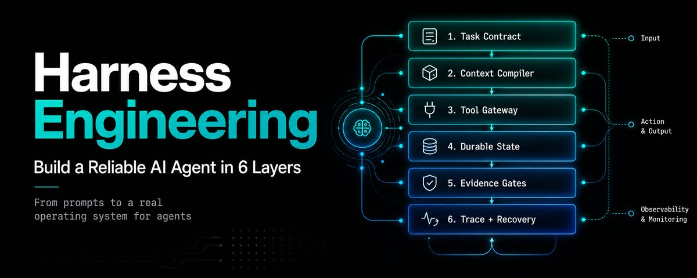
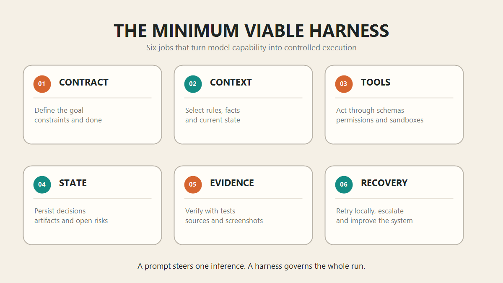
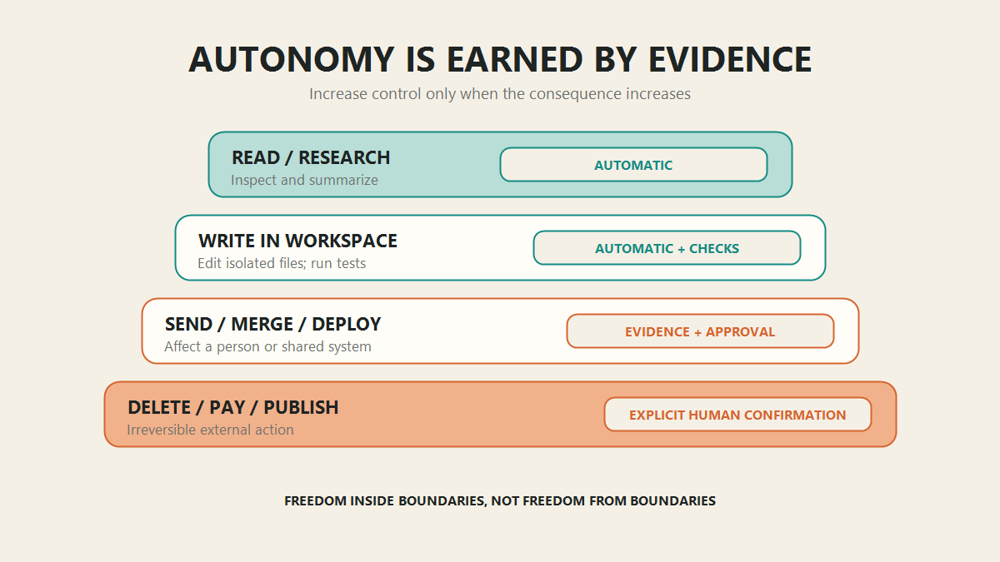
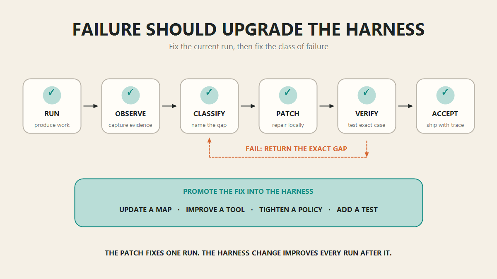

# Harness Engineering: Build a Reliable AI Agent in 6 Layers

- **作者：** Ichigo (@iiiichigo_chan)
- **出处：** https://x.com/iiiichigo_chan/article/2093765205276713218
- **发表：** 2026-08-29T18:18:19.000Z
- **存档：** 2026-09-08（API 原文 plain_text + 配图二进制；代码块另附 entities）



A better prompt can improve one answer.
A better harness improves every run.
If your agent can reason but still forgets constraints, chooses the wrong tool, skips verification, or loops until the budget is gone, the model is not the whole problem.
The environment around the model is underspecified.
This guide gives you a practical, six-layer harness you can put around a coding, research, support, or operations agent.
By the end, you will have:
a task contract
a context compiler
a permissioned tool gateway
durable state
evidence gates
a trace and recovery loop
Not another giant prompt. An operating system for the agent.
 
Why this matters now
In February 2026, OpenAI described an internal product built with zero manually written lines of code.
Five months in, the repository contained roughly one million lines of code and about 1,500 merged pull requests. OpenAI estimated that the product was built in around one-tenth the time manual development would have required.
The interesting part was not simply that Codex could write code.
It was what the human engineers had to build around Codex before that code became useful.
Their early progress was slow because the environment was underspecified. The agent lacked tools, internal structure, observable feedback, and enforceable rules. When it failed, the useful question was not “How do we make the prompt sound stronger?” It was:
What capability is missing, and how do we make it legible and enforceable for the agent?
That is harness engineering.
The model supplies probabilistic reasoning.
The harness turns that reasoning into controlled execution.
 
The prompt is one input to the system.
It is not the system.
 
The minimum viable harness
A useful harness does not need twenty services or a multi-agent swarm.
It needs six jobs to be handled explicitly.
 
1. Turn the request into a contract
Natural-language requests are flexible. Production tasks cannot be.
Before the model acts, the harness should translate the request into a bounded task object:
 
This prevents silent task substitution.
Without a contract, an agent can solve an easier version of the problem and confidently declare success.
The contract also gives the harness something objective to evaluate. “Looks good” is not a stop condition. “All four checks passed” is.
2. Compile context instead of dumping it
Context is a finite attention budget.
The common mistake is to inject everything: the full conversation, every tool result, all project documentation, and a 1,000-line instruction file.
More context is not automatically more understanding.
OpenAI’s practical rule was simple: give the agent a map, not a manual. Anthropic recommends the same general direction: keep context high-signal and retrieve additional information just in time.
Build a context compiler that assembles only what the current step needs:
 
Use progressive disclosure:
 
The root guide tells the agent where knowledge lives.
Tools retrieve the deeper material only when it becomes relevant.
The conversation should not be your database, and the system prompt should not be your filing cabinet.
3. Put a gateway between the model and every tool
The model may request an action.
The harness decides whether that action is valid, permitted, and safe to execute.
 
Every tool needs:
one clear purpose
an unambiguous schema
a scoped permission boundary
a predictable success response
a structured failure response
a timeout
The tool result should return an observation the model can reason about, not an unbounded wall of terminal output.
 
Good tool design reduces the number of decisions the model has to guess.
Bad tool design turns every action into another reasoning problem.
4. Externalize memory into durable state
Long-running agents eventually hit context limits, crash, restart, or hand work to another agent.
If critical state exists only in the transcript, the run is fragile.
Persist the state of the work outside the model:
 
Store four kinds of memory separately:
 
This distinction matters.
A temporary tool output should disappear after it is summarized. An architectural decision should survive every context reset. A lesson from a recurring failure should become a rule or a test.
Memory is not “save the entire chat.”
Memory is preserving the smallest set of information required to continue correctly.
5. Make evidence the gate to completion
The model produces an artifact.
The environment produces evidence about that artifact.
The harness decides whether the evidence is sufficient.
 
Use deterministic checks first:
 
Then use a model-based reviewer for work that requires judgment.
The maker and the checker should not share exactly the same incentives. A model that wrote an answer can still review it, but an independent verifier with different instructions and fresh context is harder to fool.
Autonomy should expand only when evidence quality expands with it.
 
6. Record the run and recover from the exact failure
Without traces, a failure becomes a story.
With traces, it becomes a reproducible test case.
Record:
 
Then classify the failure before retrying:
 
Do not blindly rerun the same environment with a more emotional prompt.
Repair the missing capability, rerun the exact failing case, and make the fix permanent.
 
The best harnesses compound.
One failure improves every future run.
 
A practical permission ladder
The model should not approve its own risky actions.
Separate proposing, authorizing, and executing:
 
A simple starting policy:
 
Do not apply maximum friction to every task.
Reading a public document and deleting customer records should not travel through the same approval path.
Match the control to the consequence.
 
The smallest useful project structure
You can build the first version of this without a framework:
 
The folder names do not matter.
The separation of responsibilities does.
 
Build it in this order
Do not begin with a swarm.
Begin with the smallest loop that can prove its own work.
Step 1 — Define “done”
Write the contract and two or three checks that determine success.
Step 2 — Wrap one tool
Give it a schema, a timeout, a permission rule, and a structured result.
Step 3 — Persist one state file
Store completed steps, decisions, artifacts, open risks, and the next action.
Step 4 — Add one recovery path
When a check fails, return the exact evidence and allow one bounded repair attempt.
Step 5 — Save the trace
Record what context was loaded, which tools ran, what changed, which checks passed, and why the run stopped.
Step 6 — Turn repeated failures into infrastructure
Every recurring mistake should become one of four things:
 
Only then should you add more autonomy, more tools, or more agents.
 
What harness engineering is not
It is not a 5,000-line system prompt.
It is not giving the agent every tool you can connect.
It is not storing the raw transcript forever and calling it memory.
It is not adding a reviewer agent to work that has no objective acceptance criteria.
It is not retrying until one stochastic run looks good.
And it is not removing humans from every decision.
A harness exists to spend human attention where judgment matters and automate the rest.
 
The metric that matters
Do not optimize for tokens generated, tool calls made, or tasks started.
Optimize for:
 
That ratio captures what a harness is supposed to do: convert model capability into useful, reviewable work without consuming equal human effort on the way out.
 
The real shift
Prompt engineering asks:
What should I tell the model?
Context engineering asks:
What should the model know right now?
Harness engineering asks:
What system lets the model act, prove its work, recover, and improve safely?
The model will keep changing.
Your harness is where your operating knowledge compounds.
Build the contract.
Compile the context.
Gate the tools.
Persist the state.
Demand evidence.
Turn failures into infrastructure.
That is how a capable model becomes a reliable agent.
 
Thanks for reading.
If you like the article, please follow @iiiichigo_chan 
 
Further reading
OpenAI — Harness engineering: leveraging Codex in an agent-first world (https://openai.com/index/harness-engineering/)
OpenAI — Unrolling the Codex agent loop (https://openai.com/index/unrolling-the-codex-agent-loop/)
Anthropic — Effective context engineering for AI agents (https://www.anthropic.com/engineering/effective-context-engineering-for-ai-agents)
Anthropic — Writing effective tools for AI agents (https://www.anthropic.com/engineering/writing-tools-for-agents)


## Article images



<!-- source: https://pbs.twimg.com/media/HQ5WP3QW0AAEQpj.png media_key: 3_2093705707304439808 -->



<!-- source: https://pbs.twimg.com/media/HQ5X_mpWYAASJ3E.png media_key: 3_2093707626991214592 -->



<!-- source: https://pbs.twimg.com/media/HQ5YQoCXkAEfVQg.png media_key: 3_2093707919422361601 -->

## Code blocks (from X article entities)

> 说明：X API 的 `plain_text` 不含代码块本体；以下从 `entities.code` 原样导出，保证不丢代码。

### Code block 1

```plaintext
text
CODE       tests + types + lint + dependency rules
UI         render + screenshot + interaction replay
RESEARCH   source coverage + citation match + contradiction check
DATA       schema + range + freshness + reconciliation
SUPPORT    policy check + PII check + approval boundary
```

### Code block 2

```json
{
  "status": "failed",
  "tool": "run_tests",
  "reason": "2 snapshot mismatches",
  "evidence": [
    "artifacts/home-mobile-before.png",
    "artifacts/home-mobile-after.png"
  ],
  "retryable": true
}
```

### Code block 3

```yaml
permissions:
  read_files:
    mode: automatic

  write_workspace:
    mode: automatic
    requires:
      - isolated_workspace
      - diff_recorded

  send_message:
    mode: approval_required
    requires:
      - final_content_preview

  deploy_production:
    mode: approval_required
    requires:
      - tests_pass
      - rollback_ready

  delete_data:
    mode: approval_required
    requires:
      - exact_targets
      - recovery_plan
```

### Code block 4

```plaintext
text
a clearer map
a better tool
a stricter permission
a new test
```

### Code block 5

```yaml
task_id: feature_042
goal: Add CSV export to the analytics dashboard

inputs:
  - issue.md
  - repository
  - design/export-flow.png

constraints:
  - preserve the public API
  - do not change the database schema
  - do not add a new dependency

deliverable:
  type: pull_request

done_when:
  - tests pass
  - typecheck passes
  - exported CSV matches the fixture
  - UI screenshot passes review

escalate_when:
  - schema change appears necessary
  - tests fail three times for the same reason
  - requested behavior conflicts with an existing product rule
```

### Code block 6

```typescript
switch (failure.type) {
  case "missing_context":
    updateProjectMap(failure.source);
    break;
  case "bad_tool_contract":
    improveToolSchema(failure.tool);
    break;
  case "missing_guardrail":
    addPolicyCheck(failure.action);
    break;
  case "weak_verification":
    addRegressionTest(failure.example);
    break;
  default:
    escalateWithEvidence(failure);
}
```

### Code block 7

```typescript
async function verify(artifact, contract) {
  const evidence = await Promise.all([
    runTests(),
    runTypecheck(),
    validateOutputSchema(artifact),
    renderAndCaptureScreenshots(),
    checkScope(contract.constraints)
  ]);

  const failed = evidence.filter(check => !check.passed);

  if (failed.length === 0) return { status: "accept", evidence };
  if (canRepairLocally(failed)) return { status: "retry", failed };
  return { status: "escalate", failed };
}
```

### Code block 8

```json
{
  "task_id": "feature_042",
  "status": "verifying",
  "current_step": "mobile_visual_check",
  "completed": [
    "implementation",
    "unit_tests",
    "desktop_visual_check"
  ],
  "decisions": [
    "reuse existing export endpoint",
    "preserve current date format"
  ],
  "artifacts": [
    "export.csv",
    "desktop-after.png"
  ],
  "open_risks": [
    "mobile toolbar may overflow at 390px"
  ],
  "next_action": "render mobile viewport"
}
```

### Code block 9

```plaintext
accepted outputs
----------------
human review minutes
```

### Code block 10

```typescript
function buildContext(task, state) {
  return [
    load("AGENTS.md"),                 // small project map
    load(task.relevantProductSpec),    // task-specific rules
    load(task.relevantArchitecture),   // local boundaries
    summarize(state.completedSteps),   // compact history
    state.openRisks,
    state.currentArtifacts
  ];
}
```

### Code block 11

```plaintext
FACTS       stable project knowledge
DECISIONS   choices made during this task
STATE       where the current run is now
LESSONS     failures that should change future runs
```

### Code block 12

```plaintext
agent-harness/
├── AGENTS.md              # small map, not an encyclopedia
├── contracts/
│   └── task.schema.json
├── context/
│   ├── architecture.md
│   ├── product-rules.md
│   └── security.md
├── tools/
│   ├── registry.json
│   └── permissions.yaml
├── state/
│   ├── current.json
│   └── decisions.md
├── checks/
│   ├── verify.ts
│   └── regression-cases/
├── runs/
│   └── traces.jsonl
└── lessons/
    └── harness-updates.md
```

### Code block 13

```plaintext
AGENTS.md
  -> architecture index
  -> product rules
  -> task-specific guide
  -> exact files and evidence
```

### Code block 14

```plaintext
MODEL
proposes the next action

HARNESS
selects context
authorizes tools
stores state
collects evidence
enforces limits
recovers from failure
```

### Code block 15

```json
{
  "run_id": "run_2026_08_29_0142",
  "contract_version": "3",
  "model_route": "reasoning-large",
  "context_sources": ["AGENTS.md", "docs/export.md"],
  "tool_calls": 17,
  "state_changes": 6,
  "verification": {
    "passed": 4,
    "failed": 1
  },
  "retries": 1,
  "cost_usd": 2.84,
  "stop_reason": "human_approval_required",
  "rollback_point": "git:9cf31d2"
}
```

### Code block 16

```plaintext
MODEL PROPOSES
      ↓
POLICY AUTHORIZES
      ↓
TOOL EXECUTES
      ↓
HARNESS RECORDS THE RESULT
```

### Code block 17

```typescript
async function handleToolRequest(request, run) {
  validateSchema(request);

  const decision = policy.authorize({
    tool: request.name,
    args: request.args,
    task: run.contract,
    risk: classifyRisk(request)
  });

  if (decision === "deny") {
    return observation("permission_denied");
  }

  if (decision === "approval_required") {
    return pauseForHumanApproval(request);
  }

  const result = await sandbox.execute(request);
  return normalizeObservation(result);
}
```
