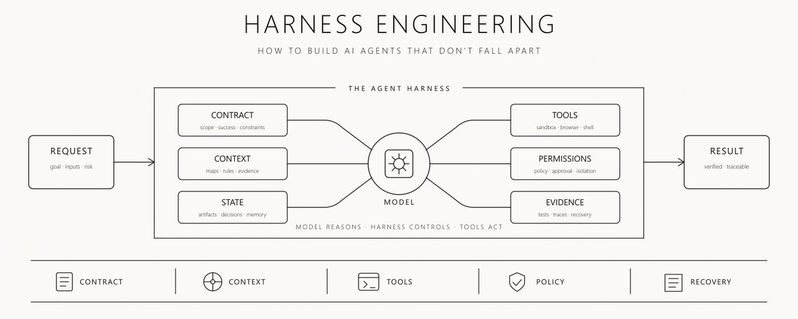
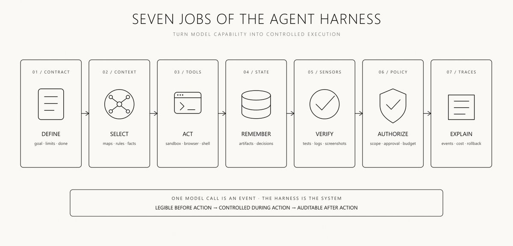
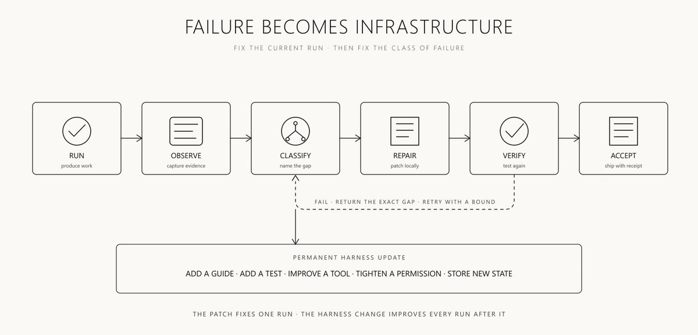

# Harness Engineering：如何构建不会崩溃的 AI Agent



大多数人面对失败的 agent 时，第一反应是改 prompt

然后他们换模型

再然后他们加大 context window

agent 依然会忘记决策

依然会用错工具

依然会跳过验证

依然会卡在同一个 loop 里

问题并不总是出在「智能」本身

问题出在它周围的环境

这个环境就是 harness

而设计它，就是 harness engineering

Anthropic CEO Dario Amodei 在解释 Claude Code 如何诞生时，说得很直接

> 「当然，你需要一个接口，你需要一个 harness 才能真正用好它们」

我在 Substack 上发布关于 AI agent、工作流与生产系统的实战拆解 [在这里订阅newsletter](https://whrrari.substack.com/subscribe?next=https%3A%2F%2Fsubstack.com%2F%40whrrari%2Fnotes&utm_source=profile-page&utm_medium=web&utm_campaign=substack_profile&just_signed_up=true)

### 模型只是推理引擎

模型可以建议下一步动作

它无法凭一己之力创造出可靠的运行环境

harness 决定模型能看见什么、能触碰什么、会话之间什么会保留、什么算作证据、以及何时必须停止本次运行

```text
MODEL
reasons and proposes actions

HARNESS
selects context
exposes tools
stores state
enforces permissions
checks results
records traces
recovers from failure
```

prompt 是这个系统中的一个组件

模型是另一个

产品，是当所有周边组件协同工作时发生的事

Prompt engineering 改进指令

Harness engineering 改进指令被执行时的条件

### 同一个模型可以变成完全不同的 agent

把同一个模型放进聊天框，它回答问题

把它放进一个带终端访问、测试、浏览器工具、项目记忆、隔离 worktree 和 review loop 的仓库里，它就能交付软件

权重没有变

变的是 harness

OpenAI 在用 Codex 构建以 agent 为先的代码库时，描述了同样的转变

早期进展缓慢，是因为环境定义不足，而不是因为模型缺少原始能力

应对方式不是让 agent「再努力一点」

而是问：缺了哪项能力，以及如何让这项能力既可读、又可强制执行

> 「环境被定义得不够清楚」

[OpenAI, Harness engineering: leveraging Codex in an agent-first world](https://openai.com/index/harness-engineering/)

这就是核心观点

当 agent 反复失败时，别再改 prompt 里的形容词

去检查模型周围的系统

### 生产级 harness 有七项职责



### 1. 把请求变成契约

在 agent 行动之前，把请求转换成一个有边界的对象

```text
{
  "goal": "ship the feature",
  "inputs": ["issue", "repository", "design"],
  "output": "reviewable pull request",
  "constraints": ["no schema changes", "preserve public API"],
  "done_when": ["tests pass", "visual check passes", "review passes"]
}
```

契约保护任务不被悄动重新定义

没有它，agent 可以完成另一份工作，却仍然宣称成功

### 2. 给 agent 一张地图

Agent 需要项目知识

它们不需要在每个 context window 里塞进每一份文档

用一份精简的根指南，告诉 agent 该去哪里找

```text
AGENTS.md
  -> architecture map
  -> testing map
  -> product rules
  -> security rules
  -> task-specific guides
```

地图保留上下文

一本巨厚手册会把它吃光

把详细知识放在它所管辖的代码、工具或工作流附近

仅在当前任务需要时再加载

### 3. 在正确的环境中暴露正确的工具

工具访问不是一排按钮

它是模型与真实世界之间的接口

每个工具都需要清晰的用途、可预期的输出、显式的失败状态，以及权限边界

```text
READ FILES       allowed by default
RUN TESTS        allowed inside sandbox
WRITE FILES      allowed inside workspace
ACCESS NETWORK   scoped by task
DEPLOY           requires approval
DELETE DATA      requires approval
```

好工具在模型有机会胡乱推理之前，就减少了歧义

坏工具迫使模型去猜发生了什么

### 4. 把记忆外置为持久状态

对话不是系统的权威记录

把决策、产物、失败和未决风险存在 context window 之外

```text
{
  "task_id": "task_042",
  "current_step": "verify_ui",
  "artifacts": ["build.zip", "report.md", "screenshot.png"],
  "decisions": ["keep existing schema"],
  "failures": ["mobile overflow at 390px"],
  "pending": ["human approval"]
}
```

下一次会话应继承工作的状态，而不是对话的失真复述

这就是 agent 如何在 context 重置、崩溃和交接中存活下来

### 5. 在增加自主性之前先加传感器

Agent 无法纠正它观察不到的东西

测试、linter、截图、日志、指标和 schema 校验器，把模糊的质量变成证据

```text
CODE       -> tests + type checks + lint
UI         -> render + screenshot + visual inspection
RESEARCH   -> source check + contradiction check
DATA       -> schema + range + freshness checks
```

模型创建产物

环境产出关于该产物的证据

harness 决定这些证据是否足以继续

### 6. 在模型之外强制执行权限

模型可以建议一个动作

harness 必须授权它

```text
MODEL SUGGESTS -> POLICY CHECKS -> TOOL EXECUTES
```

当动作昂贵、不可逆，或触及他人时，这种分离最为关键

不要让同一个概率系统既发明计划、又批准风险、再执行副作用

### 7. 记录轨迹并局部恢复

每次运行都应留下可读的轨迹

```text
request
selected context
tool calls
state changes
verification results
retries
cost
final artifact
rollback point
```

没有轨迹，失败就变成谜团

有了轨迹，失败就变成下一次 harness 改进的输入

### 指令应当变成基础设施

大多数团队把重要规则留在散文里

agent 读了它们

然后最终忽略其中一条

更强的模式是把重要规则编码两次

先写成 agent 能理解的指引

再写成 agent 无法绕过的机械检查

```text
GUIDE
"UI code may not query the database directly"

CHECK
lint fails when UI imports the repository layer
```

指引解释原因

检查强制边界

这把一次过去的失败变成永久的系统改进

下一个 agent 不需要记得那次事故

harness 替它记住了

### Loop 属于 harness

长时工作需要迭代

但「一直试到成功为止」不是控制系统

有用的 loop 有证据、有界重试、预算，以及升级路径

```text
for (let attempt = 1; attempt <= 3; attempt += 1) {
  const artifact = await build(state)
  const evidence = await verify(artifact)

  if (evidence.pass) return artifact

  state.failures.push(evidence.gap)
  state.repair = evidence.repair
}

return requestHumanReview(state)
```

模型应决定如何修复局部缺口

harness 应决定是否允许再试一次

Anthropic 在长时运行 agent 的工作中得出了类似结论

结构化产物在会话之间保持连续性，而独立的评估器给构建者具体反馈，而不是让它自己批准自己的工作

> 「找到尽可能简单的方案，只在需要时增加复杂度」

[Anthropic, Harness design for long-running application development](https://www.anthropic.com/engineering/harness-design-long-running-apps)

### 失败应当升级系统



大多数人修补当前输出

Harness 工程师修补这类失败

```text
MISSING CONTEXT   -> add a map or retrieval rule
WRONG TOOL        -> improve tool description or routing
BAD OUTPUT        -> add a validator or stronger contract
REPEATED LOOP     -> add a retry cap and escalation
UNSAFE ACTION     -> add a permission gate
LOST DECISION     -> store it in durable state
UNKNOWN FAILURE   -> add tracing and evidence capture
```

即时补丁修好一次运行

harness 变更改进此后每一次运行

这就是复利优势

好的 harness 把 agent 的错误转化为基础设施

### 分离大脑、双手与历史

当三个组件分离时，可靠的 agent 更容易推理

```text
BRAIN
the model that reasons

HANDS
the sandbox and tools that act

HISTORY
the append-only record of what happened
```

如果 sandbox 挂了，历史仍在

如果模型换了，工具与策略仍然可检查

如果任务恢复，新会话可以从产物与轨迹重建状态

Anthropic 的 Managed Agents 架构通过 session、harness 与 sandbox 明确了这种分离

[https://x.com/i/web/status/2041927687460024721](https://x.com/i/web/status/2041927687460024721)

重要的不是厂商

而是架构

推理引擎不应当同时充当文件系统、权限系统、记忆数据库和审计日志

### 给每次运行一张变更回执

当 agent 完成时，不要只保留最终输出

保留一份紧凑的回执，说明输出是如何产生的

```text
{
  "context_sources": ["issue", "repo_map", "design_spec"],
  "policy_version": "v12",
  "model_route": "complex_coding",
  "tools_used": ["shell", "browser", "tests"],
  "tests": { "passed": 42, "failed": 0 },
  "human_corrections": 1,
  "retries": 2,
  "cost_usd": 3.84,
  "accepted_artifact": "pr_1842",
  "rollback_point": "commit_7f3a"
}
```

这让模型升级可比较

让回归可归因

让审计成为可能

也防止最终答案掩盖破碎的过程

### 从能闭合 loop 的最小 harness 开始

Harness engineering 并不意味着在第一个任务之前就搭平台

从能观察、验证和恢复的最小系统开始

```text
LEVEL 0
prompt + model

LEVEL 1
project guide + tools

LEVEL 2
structured state + tests + bounded loop

LEVEL 3
permissions + traces + recovery + human gates
```

仅在任务值得时才上移复杂度

短小低风险的任务可能只需要一条 prompt 和一次 review

一次能编辑文件、访问网络并打开 pull request 的六小时编码运行，需要真正的 harness

harness 应当小于它所控制的失败面

### Harness engineering 检查清单

在把真实工作交给 agent 之前，先问

```text
[ ] Is success defined before execution begins
[ ] Can the agent find the right project knowledge without loading everything
[ ] Does every tool have a clear contract and failure state
[ ] Is execution isolated from production systems
[ ] Are important decisions stored outside the conversation
[ ] Does every risky transition have evidence
[ ] Are irreversible actions protected by approval
[ ] Does every loop have a retry cap and budget
[ ] Can the run resume after interruption
[ ] Can you explain every tool call and state change
[ ] Does failure update a guide, test, tool, or policy
[ ] Can the final artifact be rolled back
```

如果多项答案是否，更强的模型也不会让系统可靠

它只会让失败更昂贵

### 真正的转变

Prompt engineering 告诉模型做什么

Context engineering 决定模型看见什么

Harness engineering 构建模型在其中行动的世界

```text
PROMPT      -> instruction
CONTEXT     -> working view
HARNESS     -> operating system
LOOP        -> local improvement
GRAPH       -> coordination
```

模型下个月可能就变了

工具、测试、状态、策略和轨迹可以持续改进

这就是为什么持久优势正从 prompt 移到它周围的系统

最好的构建者不会只问哪个模型最聪明

他们会问哪个环境让那份智能变得可靠

这就是 harness engineering

### 如果你读到这里

-> [订阅我的 Substack](https://whrrari.substack.com/subscribe?next=https%3A%2F%2Fsubstack.com%2F%40whrrari%2Fnotes&utm_source=profile-page&utm_medium=web&utm_campaign=substack_profile&just_signed_up=true)

-> [加入我的 Telegram](https://t.me/+qqS3Qn-x1305ZmUy)

-> 收藏本文，以便在构建下一个 agent 时使用检查清单

-> [关注 @0xwhrrari](https://x.com/0xwhrrari) 获取更多 agent 系统的实战拆解
