# Harness Engineering：构建不会崩溃的 AI Agent 完整指南

- **Author:** Lunar (@LunarResearcher)
- **Source:** <https://x.com/LunarResearcher/article/2096570562625655088>
- **Published:** 2026-09-06
- **Archived:** 2026-09-08 (browser capture)

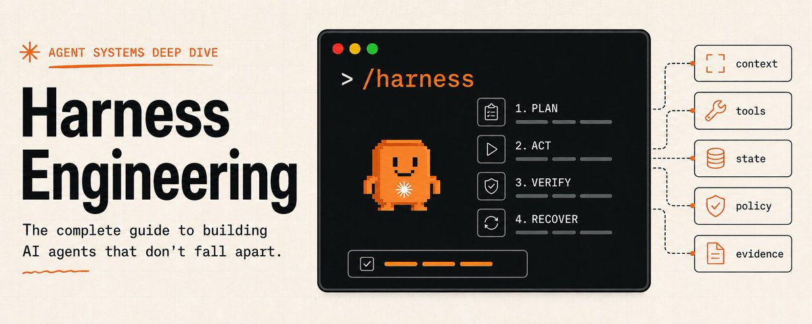

大多数人在错误的层级上试图改进 AI agent。
当 agent 失败时，他们重写 `prompt`。
当它再次失败时，他们加入更多指令。
开始之前：
关注我的 Substack，获取新鲜的 AI alpha、agent 工作流，以及先于 X 发布的分步指南：https://substack.com/@lunarresearcher
然后他们换模型、加更多工具、增大 context window，并希望下一次运行表现不同。
但许多 agent 失败并不是推理失败。
它们是环境失败。
agent 不知道哪些文件重要。
它在错误的地方使用了正确的工具。
它丢失了上一会话中做出的决策。
它声称成功却没有运行检查。
它在部分失败后重复了同一个动作。
它有权限做本应需要审批的事。
模型未必是问题。模型周围的系统不完整。
那个系统就是 `harness`。
而设计它，正成为一门独立的工程学科。
Harness Engineering 是构建那种把模型智能转化为可靠工作的环境的实践。
一条 prompt 改变一次尝试。
一个 harness 改变每一次尝试。
本指南解释如何构建一个。

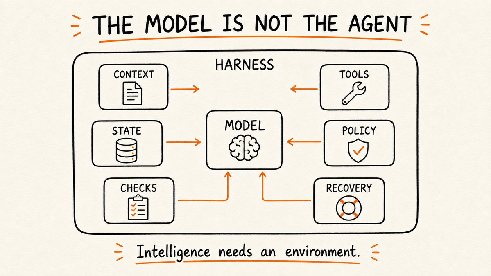
 
 
## 1. 模型不是 Agent
模型可以推理、生成、比较和选择。
但 agent 还必须与真实环境交互。
它需要：
理解任务
找到相关 context
选择并使用工具
保留状态
尊重权限
检查结果
从失败中恢复
证明工作已完成
模型是该系统内的推理引擎。
harness 是让推理可操作的一切。

```latex
user request
     |
     v
+-----------------------------+
|           HARNESS           |
| contract | context | policy |
| tools    | state   | checks |
| traces   | recovery          |
+-----------------------------+
     |
     v
    model
     |
     v
real environment
```
 
弱 harness 里的强模型，仍然是弱 agent。

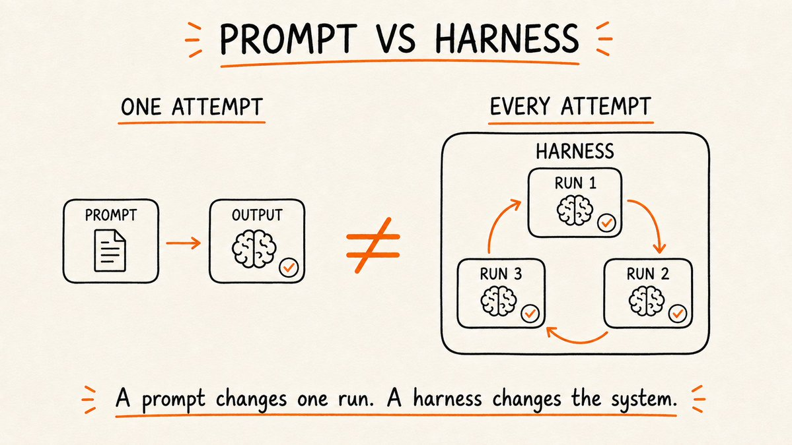
 
它可能产出令人印象深刻的个别回复，但在长任务、变化的环境和部分失败中会表现不一致。
harness engineering 的目标不是消除模型的不确定性。
而是把不确定性约束在一个能够观察、验证和恢复的系统内。
 
## 2. 从任务契约开始
大多数 agent 任务始于模糊意图：
改进 onboarding 流程。
这句话对对话或许够了。
对自主执行则不够。
在 agent 行动之前，harness 应将请求转换为任务契约。
有用的契约回答五个问题：

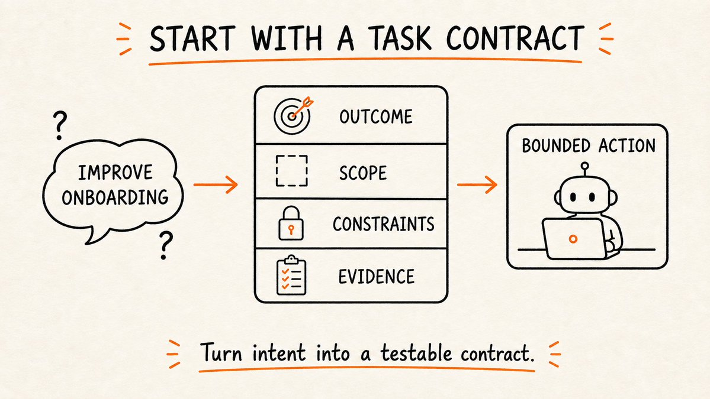
 
必须存在什么结果？

范围之内是什么？
什么绝不能改变？
什么证据证明完成？
哪些动作需要人类审批？

```yaml
objective: reduce onboarding drop-off

scope:
  - signup flow
  - onboarding analytics

constraints:
  - do not change authentication
  - preserve existing mobile behavior

acceptance:
  - tests pass
  - analytics event is emitted
  - screenshots cover desktop and mobile

approval_required:
  - production deployment
  - database migration
```
 
这把 agent 的问题从：
我下一步该做什么？
变成：
什么动作让环境朝契约结果前进？
没有契约，agent 为看似合理的活动优化。
有了契约，它可以为已验证的完成优化。
 
## 3. 给 Agent 一张地图，而不是一本手册
把整个仓库、文档集和对话历史倾倒进 context，不是好的 context engineering。
那是 context 洪水。

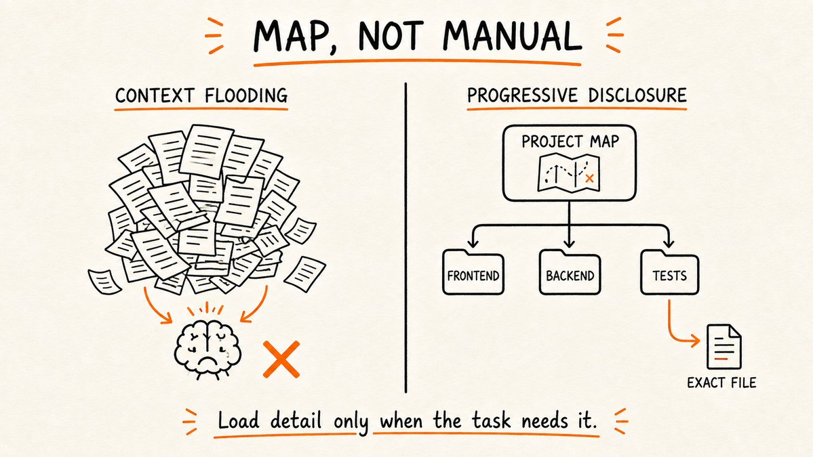
 
harness 应先提供一张小地图，再让 agent 在相关时检索细节。

```latex
PROJECT MAP

product rules     -> docs/product/
architecture      -> docs/architecture.md
frontend          -> apps/web/
backend           -> services/api/
tests             -> tests/
commands          -> docs/commands.md
release rules     -> docs/release.md
```
 
这就是渐进式披露：

```latex
task
  -> project map
      -> relevant subsystem
          -> exact files
              -> local instructions
```
 
Context 应因任务需要而扩展，而不是因为信息存在。
好的 context 编译器决定：
什么总是需要
什么可以稍后检索
什么已经过时
什么可以摘要
什么必须原文保留
目标不是最大 context。
而是每 token 的最大信号。

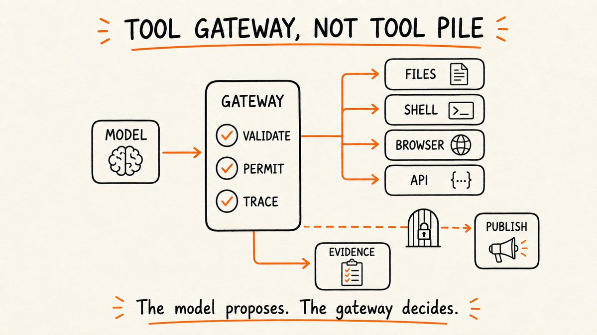
 
## 4. 构建工具网关，而不是工具堆
给 agent 二十个工具不会让它更有能力。
它给了 agent 二十种犯错的方式。
 
每个工具都应有清晰契约：

```latex
TOOL: edit_file

inputs:
  path
  patch

preconditions:
  path exists
  path is inside allowed workspace

success evidence:
  patch applied
  resulting diff returned

failure behavior:
  no partial overwrite
  structured error returned

risk class:
  reversible
```
 
harness 应控制工具如何被暴露和使用。
它可以：
隐藏无关工具
校验参数
限制路径与域名
附加超时
使重试幂等
规范化输出
对高风险动作要求确认
返回证据，而不仅仅是「success」
这创造了重要的分离：

```latex
model decides intent
gateway validates action
tool changes environment
sensor observes result
```
 
模型可以提议动作。
工具网关决定该动作是否足够有效以执行。

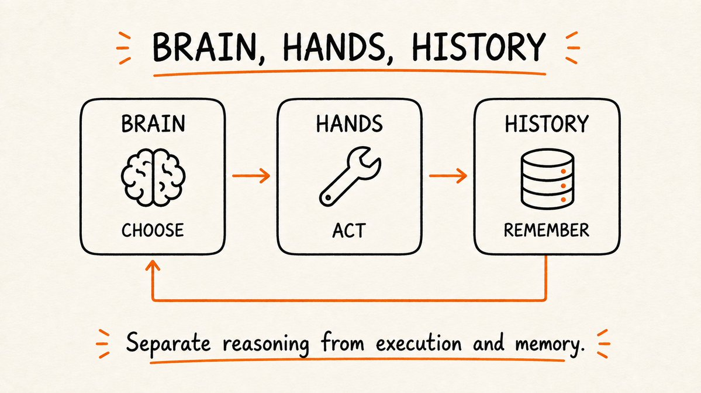
 
## 5. 分离大脑、双手与历史
许多脆弱的 agent 把一切混进不断增长的 transcript。
推理、工具调用、文件、决策、错误和旧观察都在争夺同一个 context window。
更强的系统分离三项职责：

```latex
BRAIN
plans, reasons, chooses

HANDS
execute tools inside a controlled environment

HISTORY
stores durable facts, decisions, and run state
```
 
 
模型不需要把每个原始事件放进活动 context。
它需要正确的当前状态。
sandbox 不需要理解整个目标。
它需要安全执行一个有界动作。
会话日志不需要推理。
它需要在当前 context 消失后保留发生过的事。
这种分离让长时运行的 agent 更易于恢复、检查和修复。
它也让你能替换一部分而不重建整个系统。

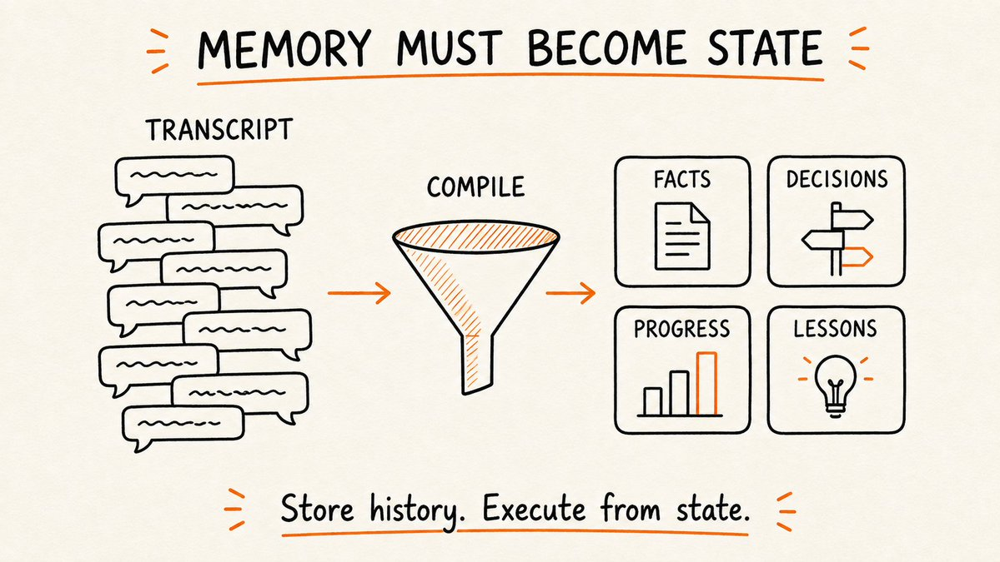
 
## 6. 记忆必须变成持久状态
对话历史不是可靠记忆。
它是事件流。
有用的记忆应转换为显式状态。
 
至少保留四类：

```latex
FACTS
stable information discovered about the environment

DECISIONS
choices made and the reason behind them

PROGRESS
completed, active, blocked, and remaining work

LESSONS
failures that should change future behavior
```
 
例如：

```yaml
facts:
  - checkout validation lives in services/orders

decisions:
  - reuse the existing validation pipeline
  - reason: avoids a second source of truth

progress:
  completed:
    - added server-side rule
  remaining:
    - update integration test

lessons:
  - local test command requires TEST_DB_URL
```
 
这远比重放五十页 transcript、希望模型注意到那一行重要内容有用得多。
为可审计性存储原始历史。
为执行编译持久状态。

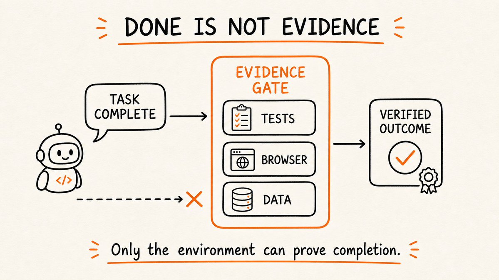
 
## 7. 完成需要证据
agent 说「done」并不是任务完成的证据。
它只是又一个模型输出。
 
完成必须由环境中可观察的变化来判定。

```latex
claim                         evidence
--------------------------------------------------
"the bug is fixed"            failing test now passes
"the page works"              browser flow completed
"the migration is safe"       dry run and rollback pass
"the report is correct"       values match source data
"the task is complete"        every acceptance check passes
```
 
harness 应先运行最便宜的确定性检查。

```latex
syntax
  -> types
      -> focused tests
          -> integration tests
              -> visual or semantic review
                  -> human approval
```
 
能用编译器、schema、校验和、查询或测试回答的问题，就不要用另一个模型。
用模型处理歧义。
用代码处理管道。
模型可以提议任务已完成。
只有环境能证明它。

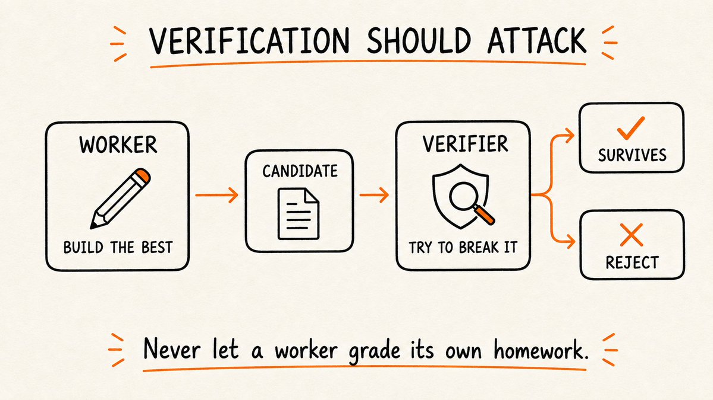
 
## 8. 验证应当攻击结果
工作者与评估者不应共享同一目标。
工作者试图创建最强的方案。
评估者试图找到应被拒绝的理由。

```latex
worker
  -> produces candidate

verifier
  -> checks contract
  -> searches for missing cases
  -> tests unsupported claims
  -> attempts to break result

survives
  -> accept

fails
  -> return targeted evidence
```
 
 
这种不对称很重要。
如果你让同一个 agent、在同一 context 中「再检查一遍自己的工作」，它往往保留造成错误的那些假设。
有用的验证阶段应具备：
显式的拒绝量规
对已产出产物的访问
对验收契约的访问
需要时的独立工具或新鲜 context
拒绝而不修复的权限
验证不是第二种意见。
它是一次尝试性证伪。
 
## 9. 模型提议，策略授权
有些规则绝不应当依赖模型是否记得它们。

```latex
never publish without approval
never expose a secret
never write outside the workspace
never exceed the spend cap
never mark tests passed unless they ran
```
 
这些不是 prompt 建议。
它们是策略。
最安全的设计把策略放在推理 loop 之外。
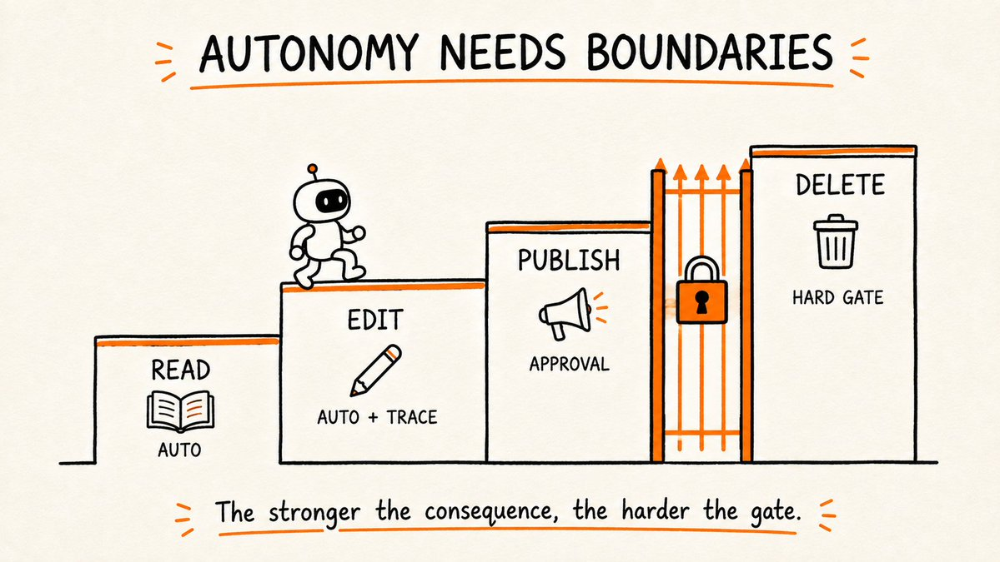

```latex
LOW RISK
read files, search, inspect
-> automatic

REVERSIBLE CHANGE
edit workspace, run tests
-> automatic with trace

EXTERNAL EFFECT
send message, deploy, purchase
-> explicit approval

IRREVERSIBLE OR SENSITIVE
delete data, rotate credentials, publish globally
-> hard gate or prohibited
```
 
 
后果越强，门控越硬。

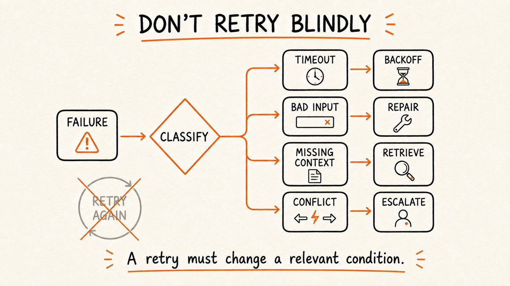
自主性不是没有控制。
它是在清晰强制的边界内自由运作的能力。
 
## 10. 恢复应针对失败类别
最常见的恢复策略是：
出了问题。再试一次。
那不是恢复。
那是重复。
 
harness 应在选择下一步动作之前对失败分类。

```latex
tool timeout
-> retry with backoff

invalid arguments
-> repair the tool call

missing context
-> retrieve specific source

failed test
-> inspect failing behavior

permission denied
-> request approval or choose safe path

contradictory requirements
-> escalate to human

repeated unchanged failure
-> stop the loop
```
 
重试应至少改变一个相关条件。
否则系统是在付费复现同一次失败。
有界的 agent loop 看起来像这样：

```latex
observe
  -> decide
      -> act
          -> measure
              -> accept
              -> repair
              -> escalate
              -> stop
```
 
每个 loop 都需要预算：
最大尝试次数
最大时间
最大花费
最大破坏范围
升级条件
可靠的 agent 知道如何继续。
它们也知道何时继续不再合理。
 
## 11. 指令应当变成基础设施
当指令解释本地现实时，它们有用。
但仅靠指令，强制力很弱。
如果一条规则反复重要，就把它下移到栈更低处。

```latex
"use the formatter"
-> run formatter automatically

"do not import across layers"
-> add architecture test

"include a migration rollback"
-> require rollback file in CI

"do not modify generated files"
-> block writes to generated paths

"cite every external claim"
-> validate citation coverage
```
 
这创造了指令阶梯：

```latex
explanation
  -> checklist
      -> template
          -> automated check
              -> enforced policy
```
 
把重要知识尽可能下移到那条阶梯。
prompt 应解释判断。
harness 应强制不变量。
 
## 12. 观察运行，而不仅仅是最终答案
干净的最终产物可以掩盖糟糕的过程。
agent 可能：
访问了错误数据
忽略了失败的命令
对外部动作重试了两次
消耗了预期预算的十倍
因错误原因到达了正确答案
你需要让运行可重建的轨迹。

```latex
09:14  contract created
09:15  context source loaded: architecture.md
09:17  file edited: checkout.ts
09:18  focused test failed: duplicate coupon
09:21  implementation repaired
09:22  focused test passed
09:24  integration test passed
09:25  external deployment blocked: approval required
```
 
有用的轨迹记录：
状态转换
context 来源
工具输入与输出
环境变化
验证结果
重试原因
审批决策
成本与延迟
目标不是监控。
目标是局部修复。
当运行在第 18 步失败时，你应能从可信检查点重启，而不是重放整个任务。
 
## 13. 每次运行需要变更回执
长 agent transcript 难以审查。
在运行结束时，harness 应编译一份小的变更回执。

```latex
OBJECTIVE
Fix duplicate coupon application during checkout.

CHANGED
- checkout validation logic
- focused regression test

VERIFIED
- lint passed
- unit tests passed
- checkout integration test passed

NOT VERIFIED
- production payment provider

DECISIONS
- preserved existing coupon priority order

RISKS
- legacy mobile client was not available locally

APPROVAL NEEDED
- deploy to staging
```
 
回执不是模型说了什么的摘要。
它是系统能证明什么的摘要。
这给人类紧凑的审查面，也给下一次 agent 会话可信的起点。
最好的交接不是「这是对话」。
而是「这是状态、证据和未解决的风险」。
 
## 14. 每次失败都应升级 Harness
最弱的团队只修失败输出。
最强的团队也修允许它发生的系统。
失败之后，问：

```latex
Was the task contract ambiguous?
Was important context invisible?
Was the wrong tool exposed?
Was a precondition missing?
Was the result unverifiable?
Was policy left inside the prompt?
Was recovery too broad?
Was the trace insufficient?
```
 
然后把教训转化为可复用的改进。

```latex
failure
  -> diagnosis
      -> new sensor, rule, map, test, or tool contract
          -> future runs improve automatically
```
 
这就是 harness 飞轮。
系统变得更可靠，因为失败留下了基础设施。
纠正的答案帮助一次运行。
纠正的 harness 帮助未来每一次运行。

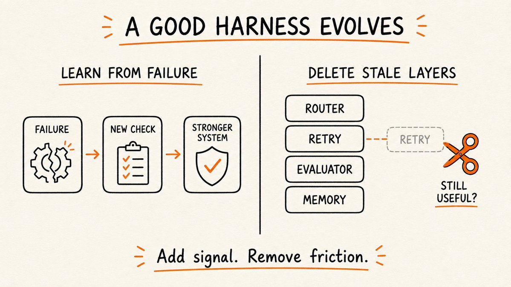
 
 
## 15. Harness 也会衰减
更多 harness 并不总是更好。
模型在改进。工具在改进。任务在变化。旧的防护可能变成不必要的摩擦。
为昨天的模型创建的变通，可能阻止今天的模型使用更好的策略。
这造成 harness 衰减：

```latex
old model limitation
  -> harness workaround
      -> model improves
          -> workaround remains
              -> system becomes slower or less capable
```
 
把 harness 组件当作生产代码对待。
衡量它们是否仍提供增益。
对每个路由器、评估器、记忆层和重试规则，问：
它防止哪种失败？
那种失败现在还多常发生？
它增加了多少延迟与复杂度？
同样结果现在能否更简单地达成？
如果我们移除它会发生什么？
最好的 harness 不是最大的那个。
而是可靠闭合意图与证据之间缺口的最小系统。
为删除而构建。
 
## 16. 最小可用 Harness
你不需要编排平台也能开始。
分层构建 harness。
Level 1: 有界任务
目标
范围
约束
验收检查
Level 2: 可读环境
项目地图
命令
本地指令
已知依赖
Level 3: 受控动作
类型化工具
参数校验
路径与权限边界
结构化结果
Level 4: 持久执行
显式运行状态
检查点
决策
教训
Level 5: 证据
确定性检查
对抗性验证
变更回执
Level 6: 恢复与学习
失败分类
有界重试
升级
从反复失败更新 harness
构建能消除你实际拥有的失败的最小层。
不要因为单条 prompt 偶尔需要澄清，就开始多 agent 架构。
复杂度应由观察到的失败挣得。
 
## 17. 可复用的 Harness 规格
在给 agent 有意义的自主性之前，定义这些：

```latex
AGENT HARNESS SPEC

1. CONTRACT
   objective:
   scope:
   constraints:
   acceptance evidence:

2. CONTEXT
   always-loaded map:
   retrieval sources:
   local instructions:
   freshness rules:

3. TOOLS
   allowed tools:
   preconditions:
   side effects:
   success evidence:
   timeout and retry policy:

4. STATE
   facts:
   decisions:
   progress:
   lessons:
   checkpoint format:

5. POLICY
   automatic actions:
   approval-required actions:
   prohibited actions:
   budget limits:

6. VERIFICATION
   deterministic checks:
   adversarial checks:
   acceptance rule:

7. RECOVERY
   failure classes:
   retry limits:
   escalation conditions:
   safe rollback:

8. OBSERVABILITY
   trace events:
   metrics:
   final change receipt:
```
 
如果这些字段未定义，agent 就不是自主的。
它是在即兴发挥。
 
## 18. 在正确层级衡量系统
Token 数不是最终指标。
尝试的任务数也不是。
有用的单位是被接受的工作。
一个实用指标是：

```latex
accepted outputs
------------------------------
human review minutes + run cost
```
 
同时跟踪：
首通接受率
工具失败后的恢复率
反复失败率
每任务的人工干预次数
无支撑的完成声明
从请求到已验证结果的时间
按组件的 harness 开销
这防止一种常见幻觉：
agent 看起来高度高产，同时制造昂贵的审查工作。
目标不是更多 agent 活动。
而是每单位人类注意力下更多可信结果。
 
## 19. 何时不需要重型 Harness
并非每次模型调用都需要操作系统。
在以下情况使用简单 prompt：
任务很短
输出易于检查
失败代价低
没有外部副作用发生
用户仍在 loop 中
在以下情况加入 harness：
工作跨多个工具或会话
环境可能变化
动作有真实后果
完成难以人工判断
同样失败反复出现
人工审查成为瓶颈
harness 的目的不是让演示看起来精巧。
而是让真实工作可靠。
 
## 真正的转变
第一代 AI 产品围绕 prompt 构建。
下一代正在围绕环境构建。
问题不再只是：
我们如何让模型回答得更好？
而是：
我们如何构建一个系统，让好动作容易、危险动作受控、失败可见、完成可证明？
这就是从 prompt engineering 到 harness engineering 的转变。
模型提供智能。
harness 提供结构。
它们一起产生可靠执行。
如果你的 agent 不断崩溃，别再给 prompt 加形容词。
构建它成功所需的环境。
 
## 如果你读到这里
收藏本指南。
在 X 上关注 @LunarResearcher
订阅我的 Substack
把本文发给仍在试图用更长 prompt 修复每一次 agent 失败的人。
