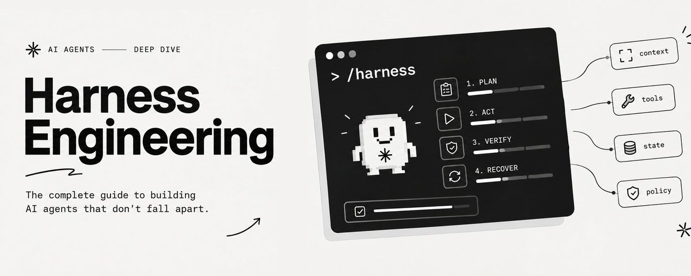

# Harness Engineering: The Field Guide to Agents That Survive Contact With Reality

Your agent fails.

You open the prompt and add a rule.

It fails differently. You add another rule.

Three weeks later your system prompt is nine hundred words of scar tissue, you have switched models twice, and the agent still cannot finish a two hour task alone.

Most of those rules were never the fix.

Because most of those failures were never about reasoning.

The prompt is the only layer you can see, so it becomes the only layer you edit.

The actual defect is somewhere else: what the agent could see, what it was allowed to touch, what it remembered, what counted as finished.

That layer has a name. It is the harness.

**Harness engineering is the practice of building the environment that turns model intelligence into work you can trust.**

> A prompt changes one run.

> A harness changes every run after it.

---

## Part I. Diagnose before you patch

Name the failure first. Almost every one lands in six buckets.

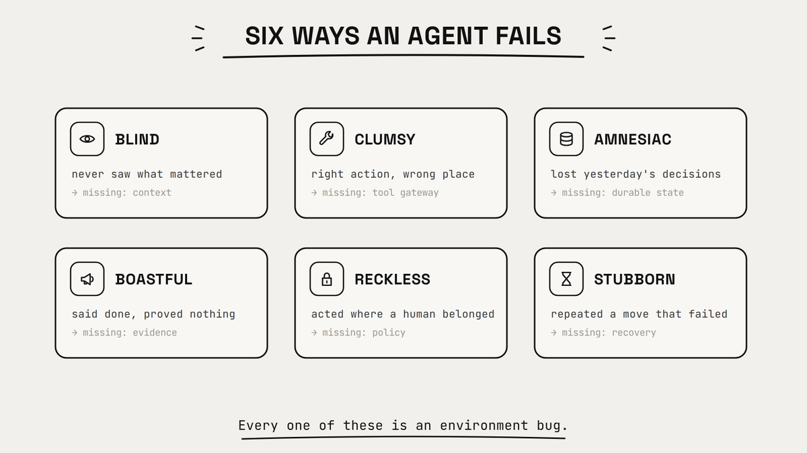

| What it looked like | What was missing |
| --- | --- |
| Edited the wrong file, missed the right one | Context |
| Ran the right command in the wrong place | Tool gateway |
| Forgot a decision made forty minutes ago | Durable state |
| Announced success without running anything | Evidence |
| Deployed something a human should have approved | Policy |
| Retried the identical failing call eleven times | Recovery |

Nothing on that list says "the model was not smart enough."

Hand a stronger model the same broken environment and you get a more articulate version of the same mistake.

Capability without structure just fails more fluently.

---

## Part II. The model is one component

A model reasons, compares, chooses.

An agent has to operate.

Operating means finding what matters, picking a tool, changing something real, tracking what changed, respecting limits, checking the result, recovering when it is wrong.

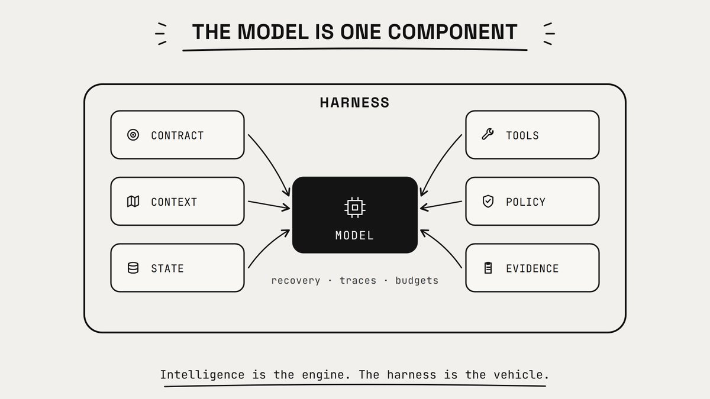

The model is the engine. The harness is the rest of the car.

A strong engine bolted to no chassis is not a fast car. It is a hazard.

The harness does not remove model uncertainty. Nothing does.

It contains that uncertainty inside a system that can observe it, verify it, and walk it back.

Seven layers do the work. Each one closes a specific failure above.

---

### Layer 1. The contract

Most agent work starts as a wish.

> Cut the refund backlog.

Fine between two people who share context.

Useless for autonomous execution: no definition of success, no definition of too far.

Compile intent into a contract before the agent moves.

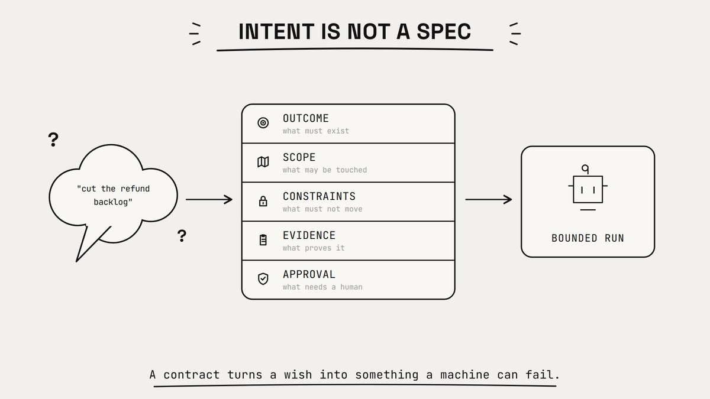

```yaml
objective: clear refunds older than 7 days

scope:
  - services/refunds
  - refund analytics events

constraints:
  - do not touch the payment provider client
  - no schema changes

acceptance:
  - queue age p95 under 48h in local replay
  - refund regression suite green
  - one refund traced end to end

approval_required:
  - any production write
  - any customer-facing message
```

Small file. Different question.

Without it, the agent optimizes for looking productive.

With it, the agent optimizes for something checkable.

A contract is also the only honest way to fail. If success was never defined, "done" is a mood.

---

### Layer 2. Context is a map, not a manual

Dumping the repo, the docs and the full history into the window is not context engineering.

It is flooding.

The one line that mattered is still in there, competing with four hundred that did not.

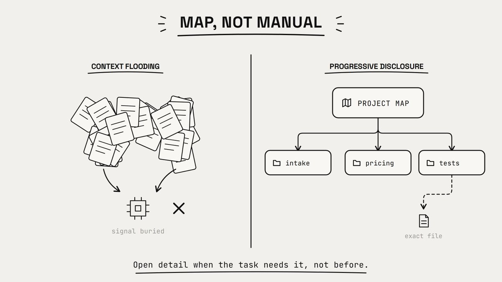

Give a map. Let the agent pull detail on demand.

### PROJECT MAP

```latex
refund rules      -> docs/refunds.md
service code      -> services/refunds/
analytics events  -> packages/events/
test commands     -> docs/testing.md
release rules     -> docs/release.md
```

Task, then map, then subsystem, then the exact file, then the local rule.

Context should expand because the task demands it, not because the data exists.

You are not maximizing context. You are maximizing signal per token.

---

### Layer 3. A gateway, not a tool pile

Twenty tools is not twenty capabilities.

It is twenty ways to be wrong, plus a selection problem on every step.

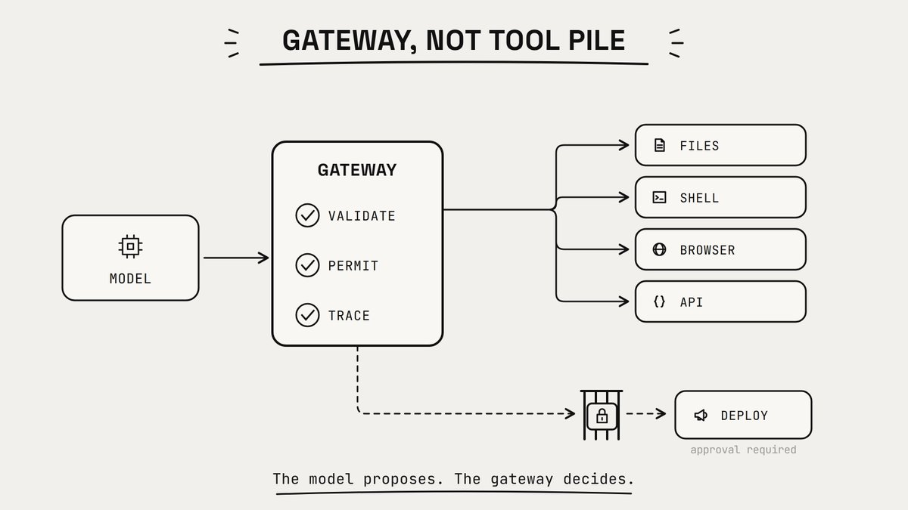

Every tool gets a contract, like an API endpoint.

```yaml
TOOL: edit_file

inputs:        path, patch
preconditions: path exists
               path inside workspace
               path is not generated code
success:       patch applied, diff returned
failure:       no partial write, structured error
risk class:    reversible
```

Then put a gateway in front of all of them.

It validates arguments, hides irrelevant tools, restricts paths and domains, sets timeouts, makes retries idempotent, and returns evidence instead of the word "success"

### The separation that matters:

**model**     proposes intent
**gateway**   authorizes the action
**tool**      changes the environment
**sensor**    reports what happened

The model gets an opinion. It does not get the last word.

---

### Layer 4. Memory has to become state

A transcript is not memory. It is an event log.

Bad substrate for execution: the critical line and the throwaway line look identical.

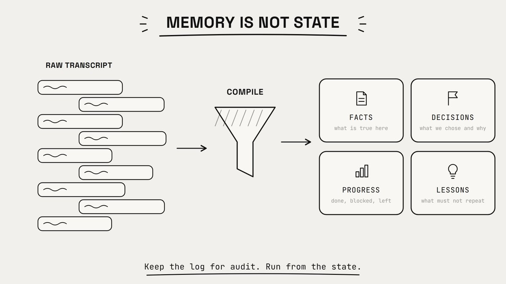

Compile the log into four buckets. Run from those.

```csharp
facts:
  - refund eligibility lives in services/refunds/policy.ts
  - the analytics pipeline drops events over 4KB

decisions:
  - reuse the existing eligibility check
  - reason: a second source of truth caused the last incident

progress:
  done:    [age based queue split]
  blocked: [staging replay needs a fresh dataset]
  left:    [regression test for partial refunds]

lessons:
  - the test runner needs TEST_DB_URL or it silently passes
```

Keep the raw log for audit. Execute from the compiled state.

This is also how you get a resumable agent.

> A run that dies at step 14 restarts from state, not from a conversation nobody wants to reread.

Keep the three concerns physically separate: the brain plans, the hands execute in a sandbox, the history survives the context window.

Separate them and you can replace one without rebuilding the other two.

---

### Layer 5. Policy sits outside the loop

Some rules must not depend on the model remembering them.

- never publish without approval
- never write outside the workspace
- never expose a credential
- never exceed the spend cap
- never mark a test passed unless it ran

Those are not instructions. Instructions are advice.

That is policy, and policy belongs in code, enforced by the gateway.

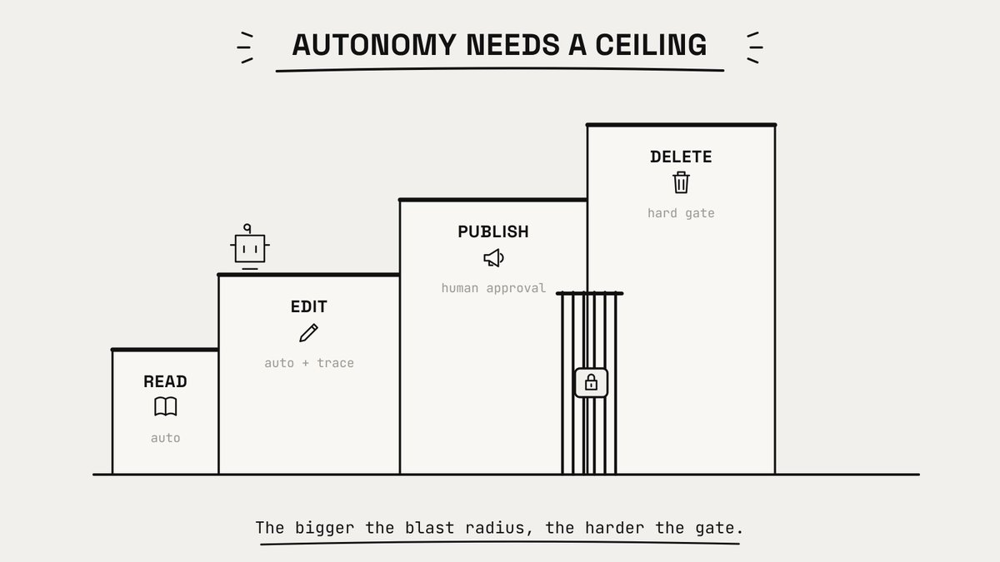

Tier by consequence.

**Read, search, inspect.** Automatic.

**Reversible change.** Automatic, but traced.

**External effect** like sending, deploying, spending. Explicit approval.

**Irreversible or sensitive** like deleting data or rotating keys. Hard gate, or not exposed at all.

Autonomy is not the absence of limits.

It is speed inside limits that are actually enforced.

---

### Layer 6. Completion needs evidence

"Task complete" is not a status. It is another token prediction.

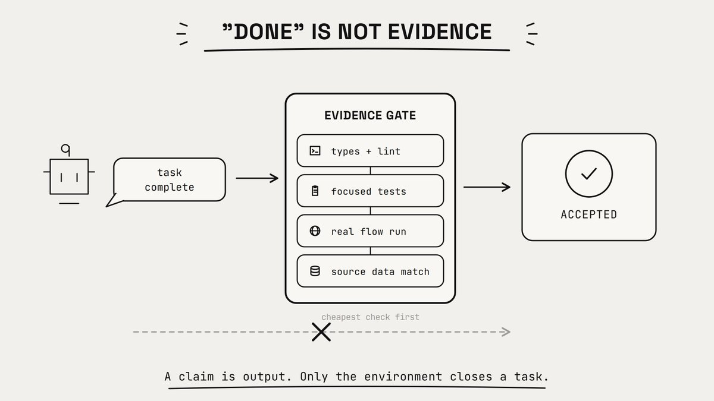

Completion is a property of the environment. Only the environment can grant it.

| Claim | Evidence |
| --- | --- |
| "the bug is fixed" | the failing test now passes |
| "the flow works" | a real session completes it |
| "the migration is safe" | dry run and rollback both pass |
| "the numbers are right" | output reconciles with source |
| "the task is complete" | every acceptance check passes |

> **Cheapest deterministic checks first: syntax, types, focused tests, integration, then judgment, then a human.**

Never spend a model call where a compiler, a schema, a checksum or a SQL query answers the question.

Models for ambiguity. Code for plumbing.

Verification is an attack

Ask the same agent in the same context to double check itself and it re-derives its own assumptions.

That is not verification. That is a confidence loop.

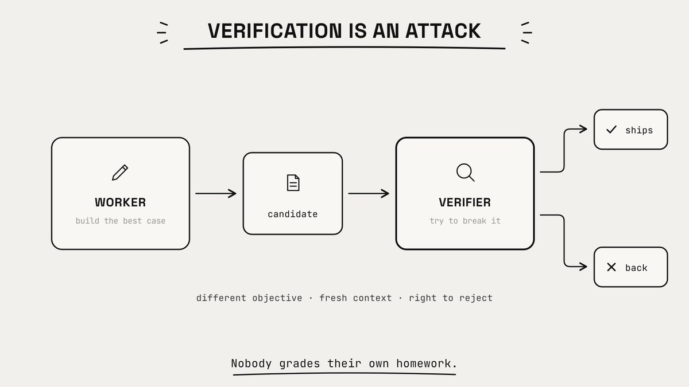

Split the objectives.

The worker builds the strongest candidate. The verifier tries to break it.

Give the verifier a rejection rubric, the artifact, the contract, and fresh context.

Also give it the right to reject without repairing.

That last one matters. A verifier that must also fix will quietly lower its standards to something it knows how to fix.

---

### Layer 7. Recovery targets the failure class

The default recovery strategy is: something broke, run it again.

That is not recovery. That is a slot machine with an API bill.

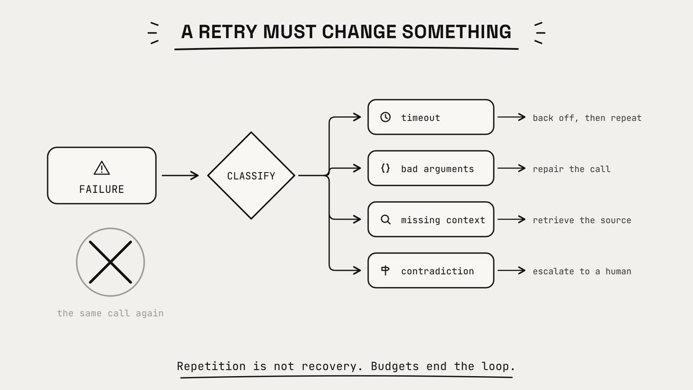

Classify, then respond.

```javascript
tool timeout              -> back off, then repeat
invalid arguments         -> repair the call
missing context           -> retrieve the specific source
failed test               -> inspect the behavior
permission denied         -> request approval or take the safe path
contradictory constraints -> escalate to a human
same failure, unchanged   -> stop
```

The rule underneath: a retry must change at least one relevant condition.

Otherwise you are paying to reproduce a known result.

> Every loop needs a budget. Max attempts, max wall clock, max spend, max destructive scope, and one escalation trigger.

Reliable agents know how to continue.

Good ones know when continuing stopped being rational.

---

## Part III. Make the run legible

A clean answer can hide an ugly process.

The agent may have read the wrong data, ignored a failed command, called an external API twice, burned ten times the budget, and been right for a reason that will not hold next week.

You want a trace that makes the run reconstructable.

```python
09:14  contract created
09:15  context loaded: docs/refunds.md
09:17  edited services/refunds/queue.ts
09:18  focused test failed: partial refund double count
09:21  repair applied
09:22  focused test passed
09:24  integration suite passed
09:25  deploy blocked: approval required
```

Record state transitions, context sources, tool inputs and outputs, verification results, retry reasons, approvals, cost, latency.

Not surveillance.

The difference between restarting at step 14 and restarting at zero.

Ship a receipt, not a transcript

Nobody reviews four hundred turns of agent chatter.

At the end of a run, compile this.

| Field | Value |
| --- | --- |
| Objective | clear refunds older than 7 days |
| Changed | queue split logic, one regression test |
| Verified | lint, unit, refund integration suite |
| Not verified | production payment provider, legacy mobile client |
| Decisions | kept existing eligibility check as single source |
| Risks | staging replay used a 3 week old dataset |
| Needs approval | deploy to staging |

The receipt is not a summary of what the model said.

It is a summary of what the system can prove.

The best handoff is never "here is the conversation."

It is "here is the state, the evidence, and the unresolved risk"

---

## Part IV. The flywheel, then the pruning

Weak teams fix the broken output.

Strong teams fix the thing that let it break.

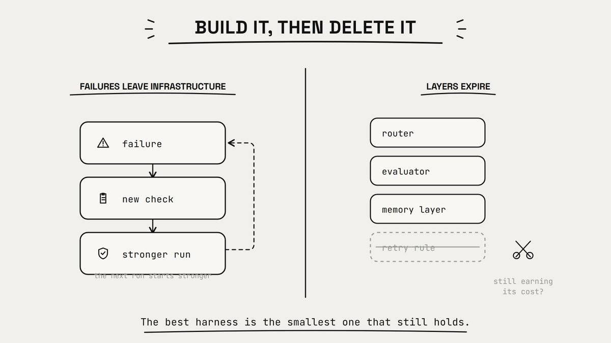

After a failure, run the diagnosis.

> Was the contract ambiguous?
> Was the context invisible?
> Was the wrong tool exposed?
> Was a precondition missing?
> Was the result unverifiable?
> Was policy living inside a prompt?
> Was recovery too broad?
> Was the trace too thin?

Then move the lesson down the ladder.

**explanation -> checklist -> template -> automated check -> enforced policy**

"Use the formatter" becomes a formatter that runs.

"Do not import across layers" becomes an architecture test.

Prompts carry judgment. The harness carries invariants.

A corrected answer helps one run. A corrected harness helps every run after it.

Then delete half of it

---

## Harnesses rot. Nobody writes about this part.

The workaround you built for last year's context limit now blocks a better strategy.

The retry rule you added after one bad week now adds four seconds to every call, for a failure that stopped happening in March.

Treat harness components like production code. Measure whether they still earn their cost.

For every router, evaluator, memory layer and retry rule:

- Which failure does this prevent?
- How often does it still happen?
- What latency and complexity does it add?
- What breaks if we remove it?

The best harness is not the biggest one.

It is the smallest system that reliably closes the gap between intent and evidence.

Build to delete.

---

## Part V. Build order

You do not need an orchestration platform. You need one layer at a time, each added after a failure you actually saw.

**1. A bounded task.** Objective, scope, constraints, acceptance.

**2. A legible environment.** Map, commands, local rules, dependencies.

**3. Controlled actions.** Typed tools, validation, path limits, structured results.

**4. Durable execution.** Explicit state, checkpoints, decisions, lessons.

**5. Evidence.** Deterministic checks, adversarial verification, receipt.

**6. Recovery and learning.** Failure classes, bounded retries, escalation, harness updates.

Do not open with multi-agent architecture because one prompt occasionally needed clarification.

Complexity is earned by observed failure, not anticipated in advance.

The spec sheet

Fill this in before you grant real autonomy.

**1. CONTRACT **             objective, scope, constraints, acceptance evidence
**2. CONTEXT**                 always-loaded map, retrieval sources, freshness rules
**3. TOOLS**                       allowed set, preconditions, side effects, timeouts
**4. STATE**                         facts, decisions, progress, lessons, checkpoints
**5. POLICY**                       automatic, approval-required, prohibited, budget caps
**6. VERIFICATION **        deterministic checks, adversarial checks, acceptance
**7. RECOVERY   **              failure classes, retry limits, escalation, rollback
**8. OBSERVABILITY **    trace events, metrics, final receipt

Blank fields mean the agent is not autonomous.

It is improvising with your credentials.

Measure the right thing

Token count is not a metric. Neither is tasks attempted.

The unit is accepted work.

```yaml
accepted outputs
--------------------------------------------
    human review minutes + run cost
```

Also track first-pass acceptance, recovery rate after tool failure, repeat failure rate, interventions per task, and unsupported completion claims.

This kills one specific illusion.

An agent can look extremely productive while generating expensive review work for a human.

Activity is not output.

When to skip all of this

Not every model call needs an operating system.

Use a plain prompt when the task is short, the output is easy to eyeball, failure is cheap, nothing external changes, and you are watching.

> Build a harness when work spans tools or sessions, the environment shifts under you, actions have consequences, completion is hard to judge by reading, the same failure keeps returning, or review has become the bottleneck.

---

## The shift

The first generation of AI products was built around prompts.

The next one is being built around environments.

The question stopped being "how do we get a better answer."

It became: how do we build a system where good actions are easy, dangerous actions are gated, failures are visible, and completion is provable.

The model supplies intelligence. The harness supplies structure.

Reliability lives in the second one.

If your agent keeps falling apart, stop adding adjectives to the prompt.

Build the environment it needs to succeed.

---

## Before You Close This Tab

You will not remember seven layers from one read.

> **Bookmark this, then open it the next time an agent fails on you and use Part I to name which layer broke.**

That is the whole point of the guide.

### **Follow [@spectnfa](https://x.com/spectnfa) on X for more on agent architecture and things that break in production.**

And send this to the person on your team who is still fixing every failure by making the prompt longer.
