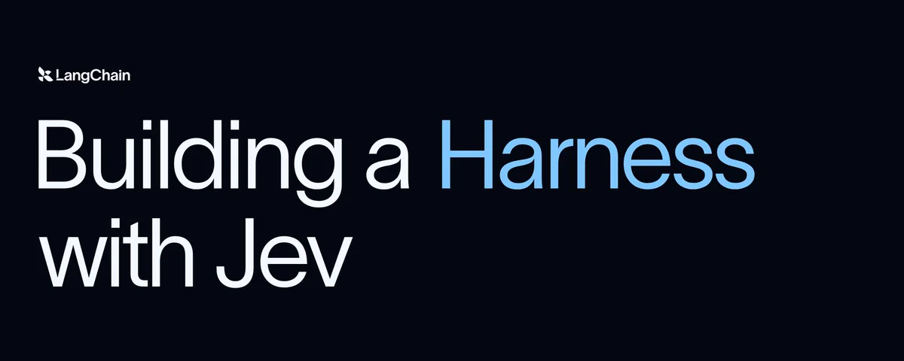
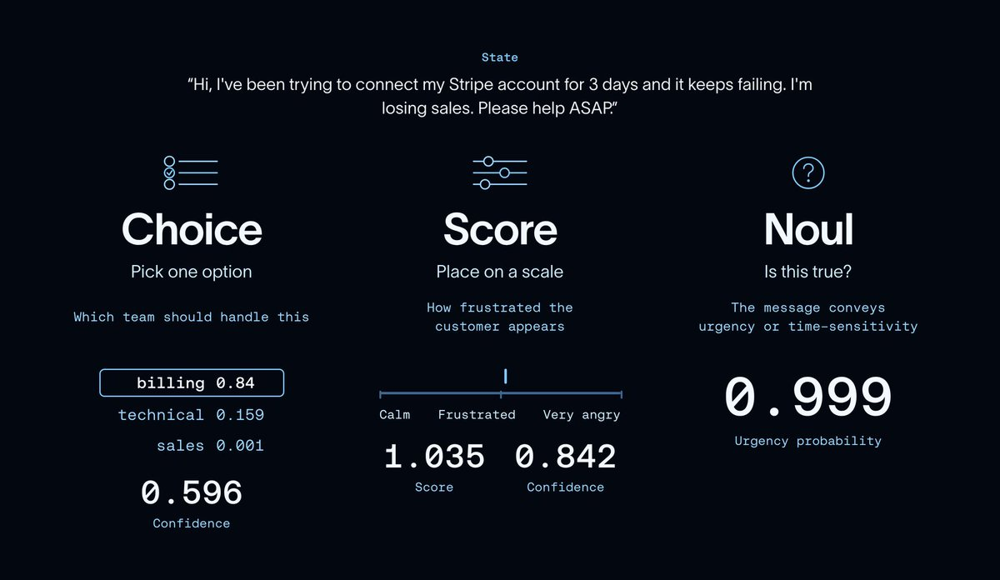

# 用 Jev 搭建 Harness

Agent 在一个循环里运行：LLM 决定下一步做什么，工具执行，模型评估结果，然后继续这个循环，直到任务完成。

Agent 和 LLM 最初很难融入依赖结构化数据与可预测接口的软件应用。后来出现了两个原语，让这件事容易了许多：

- [Tool calling](https://openai.com/index/function-calling-and-other-api-updates/) 让模型发出结构化请求并接收结构化结果。
- [Structured outputs](https://www.youtube.com/watch?v=yj-wSRJwrrc) 让模型返回结构化结果。

但即便有了这些，agent loop 依然**慢**且**贵**：每一次决策都需要再调一次模型。

于是就有了 Jev。Jev 是 [TypeSafe AI 发布](https://typesafe.ai/blog/introducing-system-one-models-and-jev)的新模型。公司称，在分类任务上，其推理速度最高可达可比 LLM 的 **200 倍**，成本低至 **1/400**。

https://x.com/i/web/status/2099925682726002904

本文将介绍 Jev 如何工作、它在 agent loop 中的位置，以及如何与 LangChain 一起使用。

## 关于 Jev

Jev 其实不是传统的 LLM，它并不生成文本。TypeSafe AI 团队称之为 System One 模型：

> 📖 System One 模型是一类 AI 模型，专为做出快速、结构化的决策而构建，软件可直接使用这些决策。System One 模型评估一个状态，并返回带类型的答案与概率。

它通过[面向校准决策的强化学习（RLCD）](https://typesafe.ai/blog/introducing-system-one-models-and-jev)训练。你的代码用这些结果指导 agent 下一步做什么，而不必为每一次决策都完整调用一次聊天 LLM。

要调用 Jev 模型，你向它发送一个**状态**（上下文）以及关于该状态的**问题**。下面是他们[文档](https://docs.typesafe.ai/introduction/quickstart)中客服工单示例的单问题版本：

```json
{
  "model": "jev-latest",
  "state": "Hi, I've been trying to connect my Stripe account for 3 days and it keeps failing. I'm losing sales. Please help ASAP.",
  "questions": {
    "is_urgent": {
      "type": "noul",
      "instructions": "The message conveys urgency or time-sensitivity"
    }
  }
}
```

文档示例给出了如下紧急程度答案（此处省略响应的其余部分）：

```json
{
  "is_urgent": {
    "type": "noul",
    "noul": 0.999
  }
}
```

也就是说，该消息为紧急的概率是 99.9%，你的应用可用它来给工单排优先级。

支持的[问题](https://www.youtube.com/watch?si=L1qd4LT9W-W67mar&t=216&v=2Bs0Ink_-Uo&feature=youtu.be)类型有三种：



- Choice：从一组选项中选择。为每个选项返回概率，以及整体置信度分数。
- Score：按有序等级对输入打分，例如低、中、高。返回连续分数、底层分布以及置信度。
- Noul：回答是/否问题。返回某陈述为真的概率。

这里的一个关键特性是：你可以在一次请求中，对同一状态提出多个问题。

> 💡 System One 模型会并行评估请求中的每一个问题。增加问题几乎不会改变响应时间，成本也只是额外问题所用的 token——而这些都很便宜。

关于对同一客服工单提出多个问题的示例，参见 [TypeSafe Quickstart](https://docs.typesafe.ai/introduction/quickstart#request-body)。

总而言之，与传统 LLM 不同，Jev 既不受文本生成的约束，也不受顺序决策的束缚！

## 如何在 LangChain 中使用 Jev

LangChain 与提供商无关的模型抽象，很适合在支持数千种其他集成与模型提供商的同时接入 Jev。

[LangChain 集成](https://docs.langchain.com/oss/python/integrations/providers/typesafe#quickstart)通过 TypeSafeClassifier 暴露 Jev。你把状态和问题传给 `.invoke()`，得到的是分类结果，而不是聊天响应。

安装 `langchain-typesafe` 并设置 `TYPESAFE_API_KEY`，然后发起一次调用：

```python
from langchain_typesafe import Noul, TypeSafeClassifier

classifier = TypeSafeClassifier()

response = classifier.invoke(
    state=(
        "The deploy failed twice and customers are seeing 500s. "
        "Can someone look now?"
    ),
    questions={
        "urgent": Noul(
            instructions="Does this need attention right now?"
        ),
    },
)

urgency = response.nouls["urgent"].noul
```

状态可以是文本、结构化数据，或 LangChain messages。这样就能很方便地在节点或 middleware hook 里，用 agent 已有的上下文调用 Jev。

你还可以把它做成自定义 middleware 或工具！

## 用例

Jev 并不是 LLM 的即插即用替代品。它不生成文本，但能处理我们今天经常用 LLM 做的分类任务，而没有同样的延迟与成本。因此它很适合作为驱动 agent 的模型的补充：用 LLM 做开放式推理与生成，用 Jev 在过程中做快速、结构化的决策。

### 模型路由（Model routing）

一次简单的查找，并不需要和棘手的调试任务用同一个模型。[Model-routing middleware](https://docs.langchain.com/oss/python/integrations/providers/typesafe#model-routing) 让 Jev 评估请求，并按你定义的标准选择模型——对简单任务用又快又便宜的，对复杂任务用更强的。

```python
from langchain.agents import create_agent
from langchain_typesafe.experimental.middleware import (
    ModelChoice,
    ModelRouterMiddleware,
)

router = ModelRouterMiddleware(
    choices={
        "fast": ModelChoice(
            model="openai:luna",
            criteria="Direct lookups, extraction, and localized changes.",
        ),
        "powerful": ModelChoice(
            model="openai:sol",
            criteria="Architecture and high-stakes decisions.",
        ),
    },
    instructions="Choose the least costly model that can complete the task.",
)

agent = create_agent("openai:gpt-5.6-luna", middleware=[router])
```

路由会根据最新的用户消息选择模型，并在整个运行过程中使用它。概率与置信度也会保留在 agent state 中。

### Auto Mode

Agent 本质上仍然不可完全信任。Agent 可能收到糟糕的指令（自然产生的，或来自足够有动机的攻击者），从而被说服去执行我们并不想要的操作。

像 Claude、Codex、Cursor 这类 coding harness，已经以某种方式在危险操作*执行之前*对其分类，这逐渐帮助建立了对 agent 的信任。直到现在，这一分类步骤一直锁在 harness 的闭源部分里。

如今有了便宜且高性能的分类模型，我们就可以把同样的模式推广到所有 agent！

```python
from langchain.agents import create_agent
from langchain_typesafe.experimental.middleware import (
    AutoModeMiddleware,
)

guardrail = AutoModeMiddleware(tools=["bash"])

agent = create_agent("openai:gpt-5.6-luna", middleware=[guardrail])
```

[AutoModeMiddleware](https://docs.langchain.com/oss/python/integrations/providers/typesafe#tool-risk-gating) 使用 Jev 检查工具调用中可能带来的风险决策，并在工具执行前拦截调用。

## 开始吧！

我们对 Jev 以及它所带来的可能性相当兴奋。已经看到的几个很酷的项目：[Kyle Jeong](https://x.com/kylejeong/status/2100622054945095934)（Browserbase）用几乎几分钱的成本驱动 browser use agent；[Jarrod Watts](https://x.com/jarrodwatts/status/2100356151468585346) 做了一个实时交易 agent；[Ryan Vogel](https://x.com/ryanvogel/status/2100042788851101842) 在大规模做邮件分流。

现在每周都有新模型发布，但这一次引发的反响相当大。我们很期待看到你用 LangChain 和 Jev 做出什么。

欢迎在[论坛](https://forum.langchain.com/)告诉我们你的想法，在 [X](https://x.com/LangChain?lang=en) 上 tag 我们并分享你正在做的东西，或参与 [LangChain issues](https://github.com/langchain-ai/langchain)！

### 致谢

感谢 [@huntlovell](https://x.com/huntlovell)、[@hwchase](https://x.com/hwchase)、[@ccurme](https://x.com/ccurme)、[@veryboldbagel](https://x.com/veryboldbagel) 以及 Nathan Drenzer 的细致审阅与贡献。
